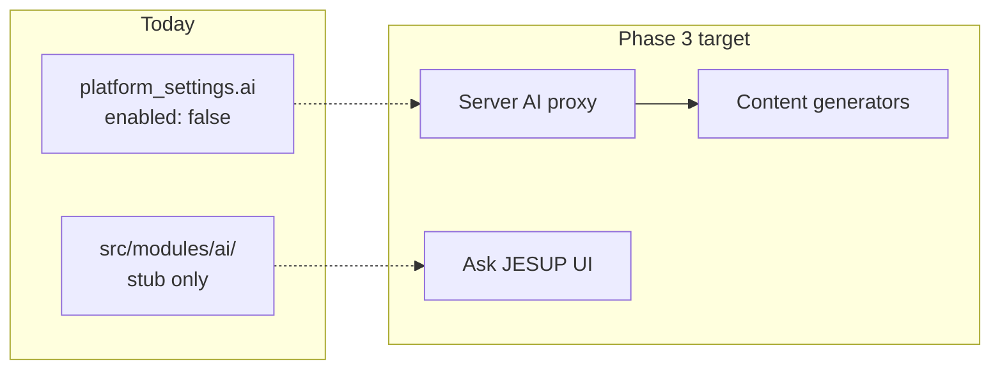
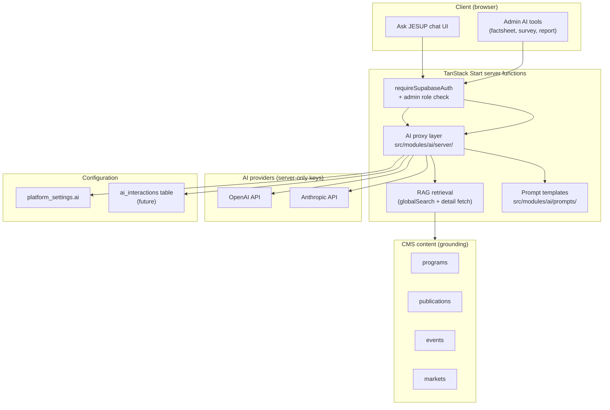
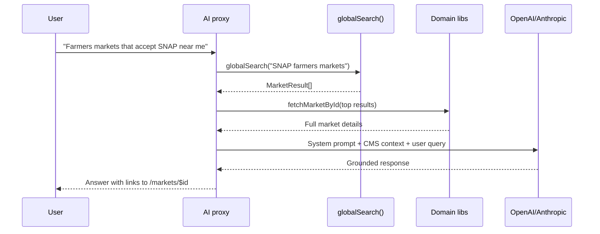

# JESUP AI Roadmap

**Document status:** Future architecture plan  
**Version:** 1.0  
**Last updated:** July 2026  
**Current status:** Scaffold only — no external AI APIs connected

---

## Table of contents

1. [Vision](#1-vision)
2. [Current state](#2-current-state)
3. [Planned AI features](#3-planned-ai-features)
4. [Architecture](#4-architecture)
5. [Data sources for AI](#5-data-sources-for-ai)
6. [Security & governance](#6-security--governance)
7. [Implementation phases](#7-implementation-phases)
8. [Provider strategy](#8-provider-strategy)
9. [Module integration points](#9-module-integration-points)

---

## 1. Vision

**Ask JESUP AI** will become a trusted Extension companion — helping farmers find markets, guiding students to 2FAS programs, assisting agents in the field, and accelerating content creation for CISC staff.

AI in JESUP is designed to:

- **Augment** Cooperative Extension staff, not replace human expertise
- **Ground** responses in CMS content (programs, publications, events, markets)
- **Respect** Tuskegee University and CISC brand voice
- **Protect** user privacy and never expose API keys to the browser

---

## 2. Current state

What exists today in the codebase:

| Item | Location | Status |
|------|----------|--------|
| AI module stub | `src/modules/ai/index.ts` | Placeholder export |
| AI settings schema | `platform_settings.ai` | `{ enabled: false, provider: null }` |
| Settings UI | `/admin/settings` → AI section | Toggle + provider field |
| Module registry flags | `aiEnabled: true` on programs, events, markets, publications, search, analytics | Metadata only |
| Server AI proxy | — | **Not built** |
| Chat UI | — | **Not built** |
| Prompt templates | — | **Not built** |



---

## 3. Planned AI features

### Ask JESUP AI (conversational assistant)

| Capability | User | Example query |
|------------|------|---------------|
| Program discovery | Students, public | "What programs does CISC offer for high school students?" |
| Market finder | Farmers | "Which farmers markets near Tuskegee accept SNAP?" |
| Event lookup | Community | "Are there any workshops on sustainable agriculture this month?" |
| Publication search | Agents, researchers | "Do you have a factsheet on cover crops?" |
| 2FAS guidance | Students | "How do I apply for the undergraduate internship track?" |
| Extension FAQ | All users | "What is the Carver Integrative Sustainability Center?" |

**Grounding strategy:** Retrieve relevant CMS content via `globalSearch()` + module-specific detail fetches before prompting the LLM (RAG pattern).

### Factsheet generator (admin)

| Input | Output |
|-------|--------|
| Research notes, bullet points, source links | Draft Extension factsheet (HTML + PDF) |
| Target audience, reading level | Tailored language |
| Category selection | Auto-assigned `publication_content_type` |

**Workflow:** Admin drafts in Command Center → review → publish to `publications` table.

### Survey summarizer (admin)

| Input | Output |
|-------|--------|
| Qualtrics survey ID or exported CSV | Executive summary of responses |
| Key themes, sentiment, recommendations | Formatted report for CISC leadership |

**Integration:** `platform_settings.qualtrics` + `surveys` table + future Qualtrics API or export upload.

### Impact report generator (admin)

| Input | Output |
|-------|--------|
| Analytics data (programs, events, registrations, markets) | Annual/quarterly impact narrative |
| Date range, audience (funders, administration) | Tailored report tone |

**Data sources:** `fetchAnalyticsSummary()`, `fetchDashboardCounts()`, registration tables.

### Grant assistant (admin)

| Input | Output |
|-------|--------|
| Grant opportunity description | Alignment assessment with CISC programs |
| Program portfolio context | Suggested proposal outline sections |
| Funder requirements | Checklist of required documents |

---

## 4. Architecture



### Planned file structure

```
src/modules/ai/
├── index.ts              # Public exports
├── types.ts              # AI request/response types
├── prompts/
│   ├── system.ts         # Base JESUP system prompt
│   ├── chat.ts           # Conversational prompts
│   ├── factsheet.ts      # Factsheet generation
│   ├── survey.ts         # Survey summarization
│   └── impact.ts         # Impact report
├── server/
│   ├── proxy.ts          # Provider abstraction
│   ├── chat.ts           # Chat endpoint handler
│   ├── generate.ts       # Content generation handlers
│   └── rag.ts            # CMS content retrieval
└── components/           # Future chat UI components
    ├── ask-jesup-chat.tsx
    └── admin-ai-panel.tsx
```

### Server function pattern (target)

```typescript
// Future: src/modules/ai/server/chat.ts
export const askJesup = createServerFn({ method: "POST" })
  .middleware([requireSupabaseAuth])
  .handler(async ({ data, context }) => {
    const settings = await fetchPlatformSettings();
    if (!settings.ai.enabled) throw new Error("AI services are disabled");

    const context_docs = await retrieveRelevantContent(data.message);
    const response = await aiProxy.chat({
      provider: settings.ai.provider,
      system: JESUP_SYSTEM_PROMPT,
      context: context_docs,
      message: data.message,
    });

    await logInteraction(context.userId, data.message, response);
    return response;
  });
```

---

## 5. Data sources for AI

AI features will ground responses in existing CMS data — never invent Extension content.

| Source | Access function | AI use |
|--------|-----------------|--------|
| Programs | `fetchPrograms()`, `fetchProgramBySlug()` | Program recommendations |
| Events | `fetchEvents()`, `fetchEventById()` | Event answers |
| Markets | `fetchMarkets()`, `fetchMarketById()` | Market finder, SNAP info |
| Publications | `fetchPublications()` | Factsheet references |
| Partners | Supabase `partners` table | Partner mentions |
| Grants | Supabase `grants` table | Funding guidance |
| Settings | `fetchPlatformSettings()` | Org name, brand voice |
| Analytics | `fetchAnalyticsSummary()` | Impact reports |

### RAG retrieval flow



---

## 6. Security & governance

| Rule | Implementation |
|------|----------------|
| **No client-side API keys** | `OPENAI_API_KEY` / `ANTHROPIC_API_KEY` are server env vars only |
| **Feature flag** | `platform_settings.ai.enabled` must be `true` |
| **Admin-only generators** | Factsheet, survey, report, grant tools require admin role |
| **User chat auth** | Ask JESUP requires authenticated session (or rate-limited anon — TBD) |
| **Audit logging** | Future `ai_interactions` table: user, prompt, response, tokens, timestamp |
| **PII protection** | Never send user emails, resumes, or application data to LLM |
| **Content review** | AI-generated factsheets require admin approval before publish |
| **Brand guardrails** | System prompt enforces CISC voice, Tuskegee affiliation, accurate disclaimers |

### Recommended system prompt principles

- Identify as "JESUP, the Digital Extension Wagon" powered by CISC
- Cite specific programs, events, and publications by name with links
- Say "I don't have that information" when CMS has no relevant content
- Never provide medical, legal, or financial advice
- Encourage users to contact CISC directly for complex inquiries

---

## 7. Implementation phases

### Phase 3A — Foundation (estimated 4–6 weeks)

| Task | Deliverable |
|------|-------------|
| Create `ai_interactions` migration | Audit table |
| Build `src/modules/ai/server/proxy.ts` | Provider abstraction (OpenAI + Anthropic) |
| Add server env vars to deployment | `OPENAI_API_KEY`, `ANTHROPIC_API_KEY` |
| Implement RAG retrieval | `server/rag.ts` using `globalSearch` + detail libs |
| Write system prompts | `prompts/system.ts`, `prompts/chat.ts` |
| Enable AI settings validation | Provider must be set when `enabled = true` |

### Phase 3B — Ask JESUP chat (estimated 4–6 weeks)

| Task | Deliverable |
|------|-------------|
| Chat UI component | Floating button or `/ask` route |
| Streaming responses | Server-sent events or chunked response |
| Conversation history | Session-based (not persisted initially) |
| Suggested prompts | "Find a market", "Browse programs", etc. |
| Link cards in responses | Deep links to `/programs/$slug`, `/markets/$id` |

### Phase 3C — Admin generators (estimated 6–8 weeks)

| Task | Deliverable |
|------|-------------|
| Factsheet generator UI | In Command Center publications section |
| Survey summarizer | Upload CSV or Qualtrics ID |
| Impact report generator | Date range + analytics pull |
| Grant assistant | In Command Center grants section |
| Preview + edit before save | Rich text editor integration |

---

## 8. Provider strategy

| Provider | Strengths | JESUP use case |
|----------|-----------|----------------|
| **OpenAI** (GPT-4o) | General chat, structured output | Ask JESUP AI, factsheet drafts |
| **Anthropic** (Claude) | Long documents, careful reasoning | Survey summaries, impact reports |

**Recommendation:** Abstract both behind `aiProxy` interface in `server/proxy.ts`. Admin selects provider in settings. Support fallback if primary provider fails.

```typescript
// Future interface
type AIProvider = "openai" | "anthropic";

interface AIProxyConfig {
  provider: AIProvider;
  model?: string;
  maxTokens?: number;
  temperature?: number;
}
```

---

## 9. Module integration points

Modules marked `aiEnabled: true` in `src/modules/core/registry.ts`:

| Module | AI integration (planned) |
|--------|--------------------------|
| **Programs** | "Tell me about this program" on detail pages |
| **Events** | "What should I expect at this workshop?" |
| **Markets** | "What's available at this market today?" (uses `market_products`) |
| **Publications** | "Summarize this factsheet" |
| **Search** | Semantic upgrade to `globalSearch()` (vector embeddings — future) |
| **Analytics** | Natural language queries over metrics |

### Future: vector search

Phase 3+ may add `pgvector` extension to Supabase for semantic search:

```sql
-- Future migration (not yet planned in detail)
ALTER TABLE programs ADD COLUMN embedding vector(1536);
```

This would upgrade RAG retrieval from keyword search to semantic similarity. Not required for Phase 3A launch.

---

## Document control

| Version | Date | Changes |
|---------|------|---------|
| 1.0 | July 2026 | Initial AI roadmap |

**See also:** [Development Roadmap](./DEVELOPMENT_ROADMAP.md) · [API Specification](./API_SPECIFICATION.md) · [System Architecture](./SYSTEM_ARCHITECTURE.md)
