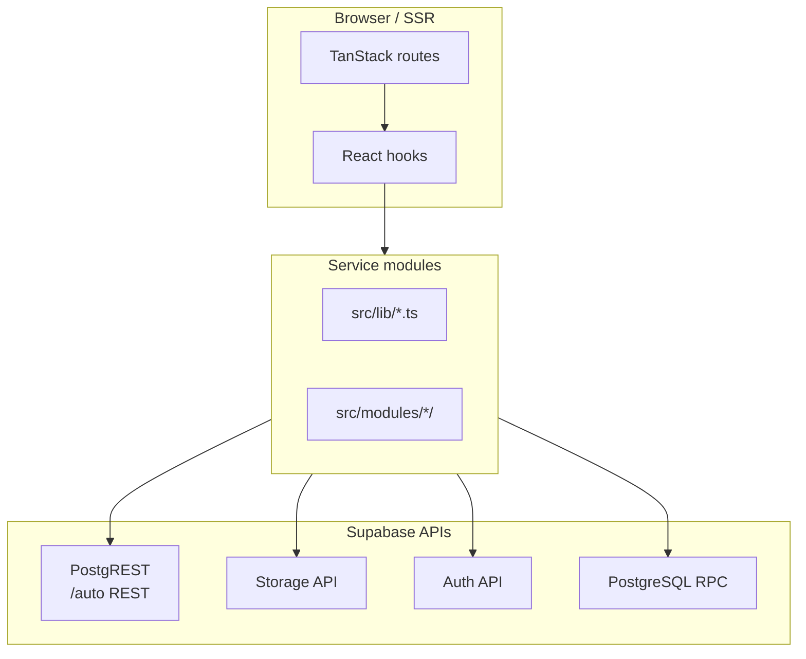

# JESUP API Specification

**Document status:** Interface reference  
**Version:** 1.0  
**Last updated:** July 2026  
**Client:** `@supabase/supabase-js` via `src/integrations/supabase/client.ts`

---

## Table of contents

1. [Overview](#1-overview)
2. [API surfaces](#2-api-surfaces)
3. [Authentication headers](#3-authentication-headers)
4. [PostgreSQL RPC functions](#4-postgresql-rpc-functions)
5. [Domain service APIs](#5-domain-service-apis)
6. [CMS platform APIs](#6-cms-platform-apis)
7. [Storage API](#7-storage-api)
8. [Server middleware](#8-server-middleware)
9. [Future server APIs](#9-future-server-apis)
10. [Error handling](#10-error-handling)

---

## 1. Overview

JESUP does not expose a custom REST API. All data access flows through **three Supabase surfaces** and **TypeScript service modules** that wrap them.



**Authorization** is enforced by PostgreSQL RLS — the publishable (anon) key is safe in the client because unauthorized rows are filtered at the database layer.

---

## 2. API surfaces

### PostgREST (primary)

Auto-generated REST from schema. Accessed via supabase-js:

```typescript
const { data, error } = await supabase
  .from("programs")
  .select("id, name, slug, cover_image_url")
  .eq("is_active", true)
  .order("sort_order");
```

| Operation | Method | Example |
|-----------|--------|---------|
| Select | `.select()` | List and detail queries |
| Insert | `.insert()` | Admin create, user registrations |
| Update | `.update().eq("id", id)` | Admin edit |
| Delete | `.delete().eq("id", id)` | Admin delete |
| Count | `.select("*", { count: "exact", head: true })` | Dashboard widgets |
| Filter | `.eq()`, `.in()`, `.gte()`, `.not()` | RLS-aware filtering |
| Join | `.select("*, program_categories(name)")` | Relation embeds |

### Supabase Auth

```typescript
// Sign in
await supabase.auth.signInWithPassword({ email, password });

// Session
const { data } = await supabase.auth.getUser();

// Sign out
await supabase.auth.signOut();
```

### Supabase Storage

```typescript
// Upload
await supabase.storage.from("market-images").upload(path, file, { upsert: true });

// Public URL
const { data } = supabase.storage.from("market-images").getPublicUrl(path);
```

---

## 3. Authentication headers

The Supabase client (`src/integrations/supabase/client.ts`) configures:

| Header | Value | When |
|--------|-------|------|
| `apikey` | `VITE_SUPABASE_PUBLISHABLE_KEY` | Every request |
| `Authorization` | `Bearer <user_jwt>` | Authenticated requests (auto-attached by supabase-js) |

For new Supabase API key format (`sb_publishable_*`), the custom fetch handler strips duplicate `Authorization` headers to avoid conflicts.

### Environment variables

| Variable | Scope | Required |
|----------|-------|----------|
| `VITE_SUPABASE_URL` | Client + SSR | Yes |
| `VITE_SUPABASE_PUBLISHABLE_KEY` | Client + SSR | Yes |
| `SUPABASE_URL` | Server only | SSR |
| `SUPABASE_PUBLISHABLE_KEY` | Server only | SSR middleware |

---

## 4. PostgreSQL RPC functions

| Function | Args | Returns | Called from |
|----------|------|---------|-------------|
| `has_role` | `_user_id: uuid`, `_role: app_role` | `boolean` | RLS policies (not called from app directly) |
| `create_program_category` | `p_name: text` | `program_categories` row | `saveProgramCategory()` in `src/lib/programs.ts` |
| `create_publication_category` | `p_name: text` | `publication_categories` row | `savePublicationCategory()` in `src/lib/publications.ts` |
| `get_event_registration_count` | `p_event_id: uuid` | `number` | Event capacity checks in `src/lib/events.ts` |

```typescript
// Example: admin category creation
const { data, error } = await supabase.rpc("create_program_category", {
  p_name: "Sustainable Agriculture",
});
```

---

## 5. Domain service APIs

Rich domain modules in `src/lib/`. Each exports typed fetch/save/delete functions.

### Programs (`src/lib/programs.ts`)

| Function | Purpose |
|----------|---------|
| `fetchPrograms(options?)` | Public list with categories |
| `fetchProgramBySlug(slug)` | Detail with relations |
| `filterPrograms(programs, search, categoryId)` | Client-side search |
| `fetchAdminPrograms()` | Admin table list |
| `fetchAdminProgramForm(id)` | Load form dialog data |
| `saveProgram(id, form)` | Create/update with junction tables |
| `deleteProgram(id)` | Delete program |
| `saveProgramCategory(name)` | RPC category create |
| `uploadProgramImage(file)` | Storage upload |

### Events (`src/lib/events.ts`)

| Function | Purpose |
|----------|---------|
| `fetchEvents(options?)` | Public list |
| `fetchEventById(id)` | Detail with sessions, speakers, gallery, relations |
| `filterEvents(events, search, categoryId, savedOnly, savedIds)` | Client filter |
| `partitionEvents(events)` | Section grouping (upcoming, this week, featured) |
| `fetchEventCategories()` | Category list |
| `saveEvent(id, form)` | Full admin save |
| `deleteEvent(id)` | Delete event |
| `registerForEvent(eventId, userId)` | User registration |
| `fetchUserEventRegistration(eventId, userId)` | Registration status |
| `getEventAnalytics(eventId)` | Per-event stats |

### Markets (`src/lib/markets.ts`)

| Function | Purpose |
|----------|---------|
| `fetchMarkets(options?)` | List with hours, distance sort |
| `fetchMarketById(idOrSlug, coords?)` | Full detail |
| `filterMarkets(...)` | Search + category + favorites filter |
| `partitionMarkets(markets)` | Section grouping |
| `saveMarket(id, form)` | Admin save with vendors/products |
| `toggleFavoriteMarket(userId, marketId, favorite)` | Favorites |
| `globalSearch` *(via cms)* | Cross-module search |
| `getMarketAnalytics()` | Platform market stats |

### Publications (`src/lib/publications.ts`)

| Function | Purpose |
|----------|---------|
| `fetchPublications(options?)` | Public list |
| `fetchPublicationBySlug(slug)` | Detail with relations |
| `filterPublications(...)` | Client filter |
| `savePublication(id, form)` | Admin save |
| `savePublicationCategory(name)` | RPC category create |

### Home (`src/lib/home/queries.ts`)

| Function | Purpose |
|----------|---------|
| `fetchHomePageData()` | Aggregated home page payload |
| `fetchHomeHeroSlides()` | Carousel from events, markets, programs, podcast |
| `fetchHomeEvents()` | Upcoming events section |
| `fetchHomeMarkets()` | Markets section (via `fetchMarkets`) |
| `fetchHomeImpactStats()` | Community impact counts |

---

## 6. CMS platform APIs

Located in `src/modules/cms/`.

### Media (`media.ts`)

| Function | Purpose |
|----------|---------|
| `fetchMediaAssets(options?)` | List media library |
| `uploadMediaAsset(file, options)` | Upload to `media-library` bucket + DB row |
| `deleteMediaAsset(id)` | Remove asset |
| `getMediaAssetCounts()` | Counts by `asset_type` |

### Relationships (`relationships.ts`)

| Function | Purpose |
|----------|---------|
| `getRelationshipsFor(sourceType)` | Available relation types for entity |
| `fetchRelatedIds(sourceType, sourceId, targetType)` | Load linked IDs |
| `saveRelationships(sourceType, sourceId, targetType, targetIds)` | Replace junction rows |
| `fetchRelationshipOptions(targetType)` | Picker options for admin forms |
| `fetchAllRelationshipOptions()` | All picker options at once |

### Search (`search.ts`)

| Function | Purpose |
|----------|---------|
| `globalSearch(query, limit?)` | Search programs, events, markets, publications, podcasts, partners, grants |

Returns `SearchResult[]` with `entityType`, `title`, `href`, `hrefParams`, `score`.

### Tags (`tags.ts`)

| Function | Purpose |
|----------|---------|
| `fetchContentTags()` | All tags |
| `createContentTag(name)` | New tag |
| `fetchEntityTags(entityType, entityId)` | Tags on entity |
| `saveEntityTags(entityType, entityId, tagIds)` | Replace tag links |

### Content metadata (`content.ts`)

| Function | Purpose |
|----------|---------|
| `extractContentMeta(row)` | Parse `metadata` JSONB + flags |
| `buildMetadataPayload(meta)` | Build save payload |
| `isPublished(meta)` / `isFeatured(meta)` | Visibility helpers |

### Notifications (`src/modules/notifications/service.ts`)

| Function | Purpose |
|----------|---------|
| `fetchNotifications(options?)` | List notifications |
| `createNotification(input)` | Create in-app notification |
| `markNotificationRead(id)` | Mark read |
| `getUnreadCount(userId?)` | Unread count |

### Settings (`src/modules/settings/service.ts`)

| Function | Purpose |
|----------|---------|
| `fetchPlatformSettings()` | Load all settings keys |
| `savePlatformSetting(key, value)` | Upsert single setting |

### Admin dashboard (`src/modules/admin/services/dashboard.ts`)

| Function | Purpose |
|----------|---------|
| `fetchDashboardCounts()` | Command Center widget counts |
| `fetchAnalyticsSummary()` | Analytics page metrics |

---

## 7. Storage API

### Upload pattern (all domains)

```typescript
export async function uploadMarketImage(file: File, prefix = "covers") {
  const path = `${prefix}/${Date.now()}-${sanitizedName}`;
  const { error } = await supabase.storage
    .from(MARKET_IMAGES_BUCKET)
    .upload(path, file, { upsert: true });
  if (error) throw error;
  const { data } = supabase.storage.from(MARKET_IMAGES_BUCKET).getPublicUrl(path);
  return data.publicUrl;
}
```

### Bucket constants

| Constant | Bucket |
|----------|--------|
| `MARKET_IMAGES_BUCKET` | `market-images` |
| `MEDIA_LIBRARY_BUCKET` | `media-library` |
| Event/program uploads | `event-images` (in respective libs) |

---

## 8. Server middleware

`src/integrations/supabase/auth-middleware.ts`

```typescript
export const requireSupabaseAuth = createMiddleware({ type: 'function' }).server(...)
```

Validates `Authorization: Bearer <jwt>` on server functions. Returns context:

```typescript
{ supabase, userId, claims }
```

Use for future server-only endpoints (AI proxy, webhooks).

---

## 9. Future server APIs

Planned TanStack Start server functions (not yet implemented):

| Endpoint | Method | Auth | Purpose |
|----------|--------|------|---------|
| `/api/ai/chat` | POST | User | Ask JESUP AI conversational endpoint |
| `/api/ai/generate/factsheet` | POST | Admin | Factsheet generator |
| `/api/ai/summarize/survey` | POST | Admin | Qualtrics response summary |
| `/api/notifications/send` | POST | Admin | Trigger email/SMS/push delivery |
| `/api/webhooks/qualtrics` | POST | Webhook secret | Survey completion events |

**Rule:** All third-party API keys (`OPENAI_API_KEY`, `ANTHROPIC_API_KEY`) must be server-only env vars — never `VITE_*`.

---

## 10. Error handling

### Client pattern

```typescript
const { data, error } = await supabase.from("programs").select("*");
if (error) throw error;
```

Admin forms catch and display via `toast.error(err.message)`.

### RLS violations

Appear as Postgres errors with code `42501` (insufficient privilege). Common causes:

- Missing `has_role` grant for anon
- User attempting admin write without admin role
- Insert without `user_id` matching `auth.uid()`

### Query invalidation

After admin saves, invalidate TanStack Query caches:

```typescript
queryClient.invalidateQueries({ queryKey: ["programs"] });
queryClient.invalidateQueries({ queryKey: ["home-page"] });
```

---

## Document control

| Version | Date | Changes |
|---------|------|---------|
| 1.0 | July 2026 | Initial API specification |

**See also:** [Database Design](./DATABASE_DESIGN.md) · [System Architecture](./SYSTEM_ARCHITECTURE.md)
