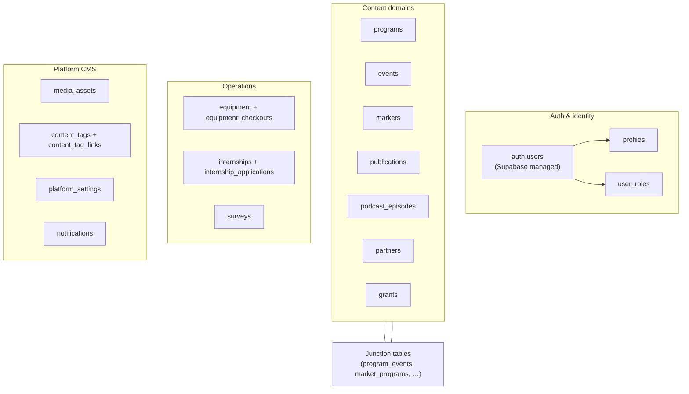
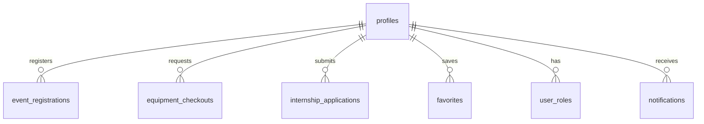
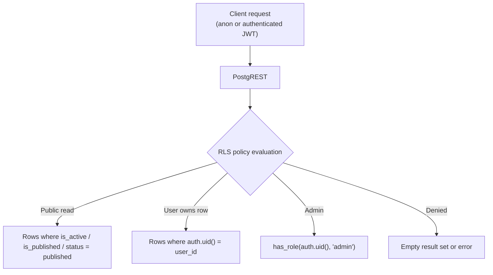

# JESUP Database Design

**Document status:** Schema reference  
**Version:** 1.0  
**Last updated:** July 2026  
**Engine:** PostgreSQL 15+ (Supabase)  
**Type definitions:** `src/integrations/supabase/types.ts`

---

## Table of contents

1. [Overview](#1-overview)
2. [Entity relationship diagram](#2-entity-relationship-diagram)
3. [Domain tables](#3-domain-tables)
4. [Junction tables (relationship engine)](#4-junction-tables-relationship-engine)
5. [Platform tables](#5-platform-tables)
6. [Enums](#6-enums)
7. [PostgreSQL functions](#7-postgresql-functions)
8. [Row Level Security](#8-row-level-security)
9. [Storage buckets](#9-storage-buckets)
10. [Migrations](#10-migrations)
11. [Conventions](#11-conventions)

---

## 1. Overview

JESUP uses **Supabase PostgreSQL** as the single source of truth. There is no separate application database. Schema changes are versioned as SQL files in `supabase/migrations/` and applied manually via the Supabase SQL Editor.



### Design principles

| Principle | Implementation |
|-----------|----------------|
| **CMS-driven** | All public content lives in Postgres — no static content tables |
| **Soft visibility** | `is_active`, `is_published`, `status` columns gate public access |
| **Relationships via junctions** | Many-to-many links use dedicated `*_events`, `*_programs` tables |
| **RLS everywhere** | Every table has Row Level Security enabled |
| **Admin via roles** | `user_roles` + `has_role()` function for privileged access |
| **Metadata JSONB** | `metadata` columns on key entities for SEO, tags, extensibility |

---

## 2. Entity relationship diagram

### Content relationships

```mermaid
erDiagram
    programs ||--o{ program_events : links
    events ||--o{ program_events : links
    programs ||--o{ program_publications : links
    publications ||--o{ program_publications : links
    programs ||--o{ program_partners : links
    partners ||--o{ program_partners : links
    programs ||--o{ program_grants : links
    grants ||--o{ program_grants : links
    programs ||--o{ program_podcast_episodes : links
    podcast_episodes ||--o{ program_podcast_episodes : links

    events ||--o{ event_partners : links
    events ||--o{ event_grants : links
    events ||--o{ event_podcast_episodes : links
    events ||--o{ event_registrations : has
    events ||--o{ event_sessions : has
    events ||--o{ event_speakers : has
    events ||--o{ event_gallery : has
    events ||--o| event_surveys : has

    publications ||--o{ publication_events : links
    publications ||--o{ publication_podcast_episodes : links
    publications ||--o{ publication_programs : links

    markets ||--o{ market_vendors : has
    market_vendors ||--o{ market_products : has
    markets ||--o{ market_hours : has
    markets ||--o{ market_images : has
    markets ||--o{ market_announcements : has
    markets ||--o{ market_events : links
    markets ||--o{ market_programs : links
    markets ||--o{ favorites : has

    programs }o--|| program_categories : categorized
    events }o--|| event_categories : categorized
    publications }o--|| publication_categories : categorized
```



### User activity



---

## 3. Domain tables

### Programs

| Table | Purpose | Key columns |
|-------|---------|-------------|
| `programs` | Extension program records | `slug`, `name`, `tagline`, `short`, `description_html`, `cover_image_url`, `is_active`, `is_featured`, `category_id`, `metadata` |
| `program_categories` | Program taxonomy | `name`, `slug`, `sort_order` |
| `program_images` | Program gallery | `program_id`, `image_url`, `sort_order` |

**Service:** `src/lib/programs.ts`  
**Public route:** `/programs`, `/programs/$slug`  
**Admin route:** `/admin/programs`

### Events

| Table | Purpose | Key columns |
|-------|---------|-------------|
| `events` | Event records | `title`, `slug`, `starts_at`, `ends_at`, `status`, `is_active`, `is_featured`, `category_id`, `location`, `lat`, `lng`, `registration_status`, `capacity`, `metadata` |
| `event_categories` | Event taxonomy | `name`, `slug` |
| `event_sessions` | Agenda items | `event_id`, `title`, `starts_at`, `location` |
| `event_speakers` | Speaker profiles | `event_id`, `name`, `title`, `bio`, `photo_url` |
| `event_gallery` | Event photos | `event_id`, `image_url`, `caption` |
| `event_surveys` | Post-event Qualtrics | `event_id`, `qualtrics_url`, `is_active` |
| `event_registrations` | User registrations | `event_id`, `user_id`, `status`, `checked_in_at` |
| `event_checkins` | QR check-in records | `registration_id`, `checked_in_at` |
| `event_certificates` | Completion certificates | `registration_id`, `certificate_url` |

**Service:** `src/lib/events.ts`  
**Public route:** `/events`, `/events/$id`  
**Admin route:** `/admin/events`

### Farmers markets

| Table | Purpose | Key columns |
|-------|---------|-------------|
| `markets` | Market records | `slug`, `name`, `address`, `city`, `state`, `lat`, `lng`, `hours`, `season`, `accepts_snap_ebt`, `is_featured`, `is_active`, `metadata` |
| `market_hours` | Structured weekly hours | `market_id`, `day_of_week`, `opens_at`, `closes_at`, `is_closed` |
| `market_images` | Photo gallery | `market_id`, `image_url`, `caption` |
| `market_vendors` | Vendor profiles | `market_id`, `name`, `slug`, `logo_url`, `seasonal_availability` |
| `market_products` | Vendor products | `vendor_id`, `name`, `category`, `available_today`, `is_organic`, `is_local` |
| `market_announcements` | Closures, weather alerts | `market_id`, `announcement_type`, `title`, `body` |
| `favorites` | User-saved markets | `user_id`, `market_id` |

**Service:** `src/lib/markets.ts`  
**Public route:** `/markets`, `/markets/$id`  
**Admin route:** `/admin/markets`

### Publications

| Table | Purpose | Key columns |
|-------|---------|-------------|
| `publications` | Publication records | `slug`, `title`, `summary`, `content_type`, `cover_image_url`, `file_url`, `is_active`, `is_featured`, `category_id`, `metadata` |
| `publication_categories` | Publication taxonomy | `name`, `slug` |
| `publication_tags` | Tag strings on publications | `publication_id`, `tag` |

**Service:** `src/lib/publications.ts`  
**Public route:** `/publications`, `/publications/$slug`  
**Admin route:** `/admin/publications`

### Podcast, partners, grants, surveys

| Table | Purpose | Public visibility |
|-------|---------|-------------------|
| `podcast_episodes` | Episodes with `cover_url`, `guest`, `is_published` | `is_published = true` |
| `partners` | Partner orgs with `logo_url`, `is_published` | `is_published = true` |
| `grants` | Grant opportunities | Public list (no `is_active` filter in route) |
| `surveys` | Qualtrics survey links | Admin-managed links |

### Equipment & internships (2FAS)

| Table | Purpose | Auth required |
|-------|---------|---------------|
| `equipment` | Inventory items | Public read |
| `equipment_checkouts` | Checkout requests | User insert; admin approve |
| `internships` | Internship / 2FAS listings | Public read |
| `internship_applications` | Applications with resume | User insert; admin review |

**Checkout status enum:** `pending | approved | denied | checked_out | returned`  
**Application status enum:** `pending | reviewed | accepted | rejected`

### Auth & profiles

| Table | Purpose |
|-------|---------|
| `profiles` | Extended user profile (linked to `auth.users`) |
| `user_roles` | Role assignments (`admin`, `user`) |

---

## 4. Junction tables (relationship engine)

Configured in `src/modules/cms/relationships.ts` as `RELATIONSHIP_REGISTRY`.

| Junction table | Entity A | Entity B | Sort column |
|----------------|----------|----------|-------------|
| `program_events` | program | event | `sort_order` |
| `program_publications` | program | publication | `sort_order` |
| `program_partners` | program | partner | `sort_order` |
| `program_grants` | program | grant | `sort_order` |
| `program_podcast_episodes` | program | podcast_episode | `sort_order` |
| `publication_events` | publication | event | `sort_order` |
| `publication_podcast_episodes` | publication | podcast_episode | `sort_order` |
| `publication_programs` | publication | program | `sort_order` |
| `event_partners` | event | partner | `sort_order` |
| `event_grants` | event | grant | `sort_order` |
| `event_podcast_episodes` | event | podcast_episode | `sort_order` |
| `market_events` | market | event | `sort_order` |
| `market_programs` | market | program | `sort_order` |

### Save pattern (application layer)

On admin save, domain services:

1. `DELETE` all junction rows for the parent entity
2. `INSERT` new rows from form `*Ids` arrays with `sort_order`

This replace-all pattern is used in `saveProgram`, `saveEvent`, `saveMarket`, `savePublication`.

---

## 5. Platform tables

Added in `20260708310000_platform_architecture.sql`.

| Table | Purpose | Key columns |
|-------|---------|-------------|
| `media_assets` | Global media library | `name`, `asset_type`, `url`, `bucket`, `module_context`, `tags[]` |
| `content_tags` | Reusable tag vocabulary | `name`, `slug` |
| `content_tag_links` | Tag ↔ entity associations | `tag_id`, `entity_type`, `entity_id` |
| `platform_settings` | Key-value system config | `key`, `value` (JSONB) |
| `notifications` | Notification queue | `user_id`, `channel`, `status`, `title`, `body` |

### Default `platform_settings` keys

| Key | Contents |
|-----|----------|
| `organization` | CISC name, institution, tagline |
| `brand` | Primary/accent colors |
| `homepage` | Hero enabled flag |
| `navigation` | Donate link visibility |
| `maps` | Map provider (`google`) |
| `qualtrics` | Integration enabled, base URL |
| `ai` | AI enabled, provider |
| `email` | From name, from address |
| `storage` | Default bucket name |

---

## 6. Enums

| Enum | Values | Used by |
|------|--------|---------|
| `app_role` | `admin`, `user` | `user_roles`, `has_role()` |
| `application_status` | `pending`, `reviewed`, `accepted`, `rejected` | `internship_applications` |
| `checkout_status` | `pending`, `approved`, `denied`, `checked_out`, `returned` | `equipment_checkouts` |
| `event_status` | `draft`, `published`, `archived` | `events` |
| `event_registration_status` | `open`, `closed`, `waiting_list`, `sold_out`, `invite_only` | `events` |
| `event_registration_record_status` | `registered`, `waiting_list`, `cancelled` | `event_registrations` |
| `publication_content_type` | `factsheet`, `report`, `magazine`, `newsletter`, `video`, `external_link`, `research_publication`, `extension_bulletin` | `publications` |
| `market_product_category` | `fruit`, `vegetables`, `meat`, `eggs`, `dairy`, `honey`, `plants`, `flowers`, `value_added`, `prepared_foods`, `crafts` | `market_products` |
| `market_announcement_type` | `general`, `closure`, `weather`, `seasonal` | `market_announcements` |
| `media_asset_type` | `image`, `video`, `pdf`, `magazine_cover`, `factsheet`, `audio`, `logo`, `document` | `media_assets` |
| `notification_channel` | `in_app`, `email`, `sms`, `push` | `notifications` |
| `notification_status` | `pending`, `sent`, `failed`, `read` | `notifications` |

---

## 7. PostgreSQL functions

| Function | Type | Purpose |
|----------|------|---------|
| `has_role(_user_id, _role)` | SECURITY DEFINER | RLS policy helper — checks `user_roles` |
| `create_program_category(p_name)` | SECURITY DEFINER | Admin category creation (bypasses RLS) |
| `create_publication_category(p_name)` | SECURITY DEFINER | Admin category creation (bypasses RLS) |
| `get_event_registration_count(p_event_id)` | SECURITY DEFINER | Accurate registration count for capacity checks |

### Critical grant

```sql
GRANT EXECUTE ON FUNCTION public.has_role TO anon, authenticated;
```

Without this grant, RLS policies calling `has_role()` fail for anonymous public reads.

---

## 8. Row Level Security



### Policy patterns by domain

| Domain | Public SELECT | Authenticated INSERT | Admin ALL |
|--------|---------------|---------------------|-----------|
| **programs** | `is_active = true` | — | `has_role(admin)` |
| **events** | `is_active = true` AND `status = published` | — | `has_role(admin)` |
| **markets** | `is_active = true` | — | `has_role(admin)` |
| **market child tables** | Via parent market active check | — | `has_role(admin)` |
| **publications** | `is_active = true` | — | `has_role(admin)` |
| **event_registrations** | Own rows only | Own `user_id` | `has_role(admin)` |
| **equipment_checkouts** | Own rows only | Own `user_id` | `has_role(admin)` |
| **internship_applications** | Own rows only | Own `user_id` | `has_role(admin)` |
| **favorites** | Own rows only | Own `user_id` | — |
| **media_assets** | `is_active = true` | — | `has_role(admin)` |
| **platform_settings** | — | — | `has_role(admin)` |
| **notifications** | Own rows | — | `has_role(admin)` + own update |

### Storage RLS

Storage policies mirror table RLS:

- **Public buckets:** `SELECT` for `anon` + `authenticated`
- **Write:** `has_role(auth.uid(), 'admin')` only
- **Resumes bucket:** User can update only files in their own `auth.uid()` folder path

---

## 9. Storage buckets

| Bucket | Public | Used by |
|--------|--------|---------|
| `publications` | Yes | Publication PDFs and files |
| `market-images` | Yes | Market covers, gallery, vendor logos |
| `event-images` | Yes | Event covers and gallery |
| `equipment-images` | Yes | Equipment photos |
| `partner-logos` | Yes | Partner branding |
| `podcast-images` | Yes | Episode cover art |
| `media-library` | Yes | Global CMS media assets |
| `resumes` | **No** | 2FAS / internship application resumes |

Upload helpers live in domain libs (`uploadMarketImage`, `uploadEventImage`, etc.) and `src/modules/cms/media.ts`.

---

## 10. Migrations

Apply in **chronological order** via Supabase SQL Editor:

| Migration | Scope |
|-----------|-------|
| `20260708002*_*.sql` | Initial schema (profiles, roles, base tables) |
| `20260708114742_*.sql` | Event registration RPC |
| `20260708120000_event_registration_count_rpc.sql` | Registration count function |
| `20260708143000_storage_buckets.sql` | Storage buckets and policies |
| `20260708170000_programs_management.sql` | Programs base |
| `20260708180000_programs_phase2b.sql` | Programs enrichment |
| `20260708190000_publications_phase2c.sql` | Publications platform |
| `20260708200000_fix_has_role_anon_rls.sql` | Critical RLS fix |
| `20260708210000_program_categories_seed.sql` | Category seeds |
| `20260708220000_program_categories_trim.sql` | Category cleanup |
| `20260708230000_events_phase3a.sql` | Events platform |
| `20260708231000_event_categories_seed.sql` | Event category seeds |
| `20260708232000_fix_category_admin_rls.sql` | Category RPC + grants |
| `20260708300000_markets_phase3b.sql` | Farmers markets platform |
| `20260708310000_platform_architecture.sql` | CMS tables, media library, settings, notifications |

After applying migrations, update `src/integrations/supabase/types.ts` to reflect new tables and columns.

---

## 11. Conventions

### Naming

| Layer | Convention | Example |
|-------|------------|---------|
| Database columns | `snake_case` | `cover_image_url`, `is_active` |
| TypeScript types | `camelCase` | `coverImageUrl`, `isActive` |
| Junction tables | `{entity_a}_{entity_b}` | `program_events` |
| Foreign keys | `{table}_id` | `program_id`, `event_id` |

### Visibility flags

| Flag | Tables | Meaning |
|------|--------|---------|
| `is_active` | programs, events, markets, publications | Published to public when `true` |
| `is_published` | podcast_episodes, partners | Published to public when `true` |
| `status` | events | `draft`, `published`, `archived` |
| `is_featured` | programs, events, markets, publications | Featured on home / section carousels |

### IDs

- All primary keys are **UUID** (`gen_random_uuid()`)
- Public detail routes accept UUID or `slug` where slug column exists

### Timestamps

- `created_at` and `updated_at` on all major tables (default `now()`)

---

## Document control

| Version | Date | Changes |
|---------|------|---------|
| 1.0 | July 2026 | Initial database design reference |

**See also:** [API Specification](./API_SPECIFICATION.md) · [System Architecture](./SYSTEM_ARCHITECTURE.md)
