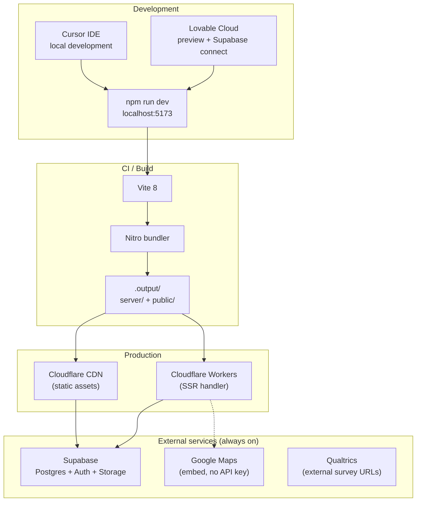
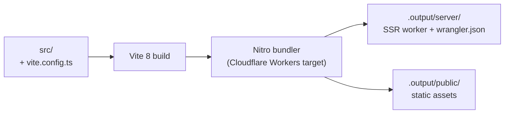
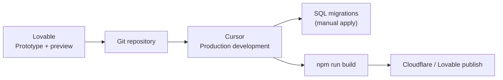

# JESUP Deployment Guide

**Document status:** Operations reference  
**Version:** 1.0  
**Last updated:** July 2026

---

## Table of contents

1. [Architecture overview](#1-architecture-overview)
2. [Environments](#2-environments)
3. [Local development](#3-local-development)
4. [Environment variables](#4-environment-variables)
5. [Database setup](#5-database-setup)
6. [Build process](#6-build-process)
7. [Production deployment](#7-production-deployment)
8. [Lovable → Cursor workflow](#8-lovable--cursor-workflow)
9. [Post-deploy checklist](#9-post-deploy-checklist)
10. [Troubleshooting](#10-troubleshooting)

---

## 1. Architecture overview



### Stack summary

| Layer | Technology | Deployed to |
|-------|------------|-------------|
| Frontend | React 19 + TanStack Start | Cloudflare Worker (SSR) + CDN (static) |
| Build | Vite 8 + Nitro | `.output/` directory |
| Database | Supabase PostgreSQL | Supabase Cloud (managed) |
| Auth | Supabase Auth | Supabase Cloud |
| Storage | Supabase Storage | Supabase Cloud |
| Config | `@lovable.dev/vite-tanstack-config` | Build-time |

---

## 2. Environments

| Environment | Purpose | Supabase project |
|-------------|---------|------------------|
| **Local** | Developer machines (`npm run dev`) | Development project |
| **Preview** | Lovable Cloud preview deploys | Development project |
| **Production** | Live JESUP site | Production project (recommended separate) |

**Recommendation:** Use separate Supabase projects for development and production. Apply migrations to dev first, verify, then apply to production.

---

## 3. Local development

### Prerequisites

- Node.js 22+
- npm
- Supabase project with URL and publishable key
- Git

### Setup

```bash
git clone <repository-url>
cd jesup-by-cisc
npm install
```

### Environment file

Create `.env` in project root (or connect via Lovable Cloud which sets vars automatically):

```env
VITE_SUPABASE_URL=https://<project-ref>.supabase.co
VITE_SUPABASE_PUBLISHABLE_KEY=<your-publishable-key>
```

For SSR/server middleware, also set (usually auto-injected in Lovable):

```env
SUPABASE_URL=https://<project-ref>.supabase.co
SUPABASE_PUBLISHABLE_KEY=<your-publishable-key>
```

### Start dev server

```bash
npm run dev
```

App runs at `http://localhost:5173` (port may vary; check terminal output).

### Create admin user

1. Visit `/auth` and sign up with email/password.
2. In Supabase SQL Editor:

```sql
INSERT INTO user_roles (user_id, role)
VALUES ('<your-auth-user-uuid>', 'admin');
```

3. Visit `/admin` — you should see the JESUP Command Center.

---

## 4. Environment variables

| Variable | Required | Scope | Description |
|----------|----------|-------|-------------|
| `VITE_SUPABASE_URL` | Yes | Client + build | Supabase project URL |
| `VITE_SUPABASE_PUBLISHABLE_KEY` | Yes | Client + build | Anon/publishable API key |
| `SUPABASE_URL` | SSR | Server | Same as above for SSR |
| `SUPABASE_PUBLISHABLE_KEY` | SSR | Server | Same as above for SSR |
| `OPENAI_API_KEY` | Future | **Server only** | AI proxy (Phase 3) |
| `ANTHROPIC_API_KEY` | Future | **Server only** | AI proxy (Phase 3) |

### Security rules

- **Never** commit `.env` to git (should be in `.gitignore`).
- **Never** prefix secret keys with `VITE_` — they would ship to the browser bundle.
- The publishable key is safe in the client — RLS protects data access.

---

## 5. Database setup

### Apply migrations

Migrations live in `supabase/migrations/`. Apply **in chronological order** via Supabase SQL Editor:

1. Open Supabase Dashboard → SQL Editor
2. Paste contents of each migration file
3. Run in order (sorted by filename timestamp)
4. Verify no errors before proceeding to next migration

### Migration order (current)

```
20260708002046_*.sql
20260708002127_*.sql
20260708002908_*.sql
20260708114742_*.sql
20260708120000_event_registration_count_rpc.sql
20260708143000_storage_buckets.sql
20260708170000_programs_management.sql
20260708180000_programs_phase2b.sql
20260708190000_publications_phase2c.sql
20260708200000_fix_has_role_anon_rls.sql
20260708210000_program_categories_seed.sql
20260708220000_program_categories_trim.sql
20260708230000_events_phase3a.sql
20260708231000_event_categories_seed.sql
20260708232000_fix_category_admin_rls.sql
20260708300000_markets_phase3b.sql
20260708310000_platform_architecture.sql
```

### Update TypeScript types

After schema changes, update `src/integrations/supabase/types.ts` to match new tables, columns, and enums. This file is the TypeScript contract for all service modules.

### Verify RLS

After migrations, confirm public reads work:

```sql
-- Should return rows (as anon)
SET ROLE anon;
SELECT id, name FROM programs WHERE is_active = true LIMIT 5;
RESET ROLE;
```

---

## 6. Build process

```bash
npm run build
```

### What happens



### Build output

| Path | Contents |
|------|----------|
| `.output/server/index.mjs` | Cloudflare Worker entry |
| `.output/server/wrangler.json` | Worker configuration |
| `.output/server/_ssr/*.mjs` | Per-route SSR bundles |
| `.output/public/` | CSS, JS chunks, fonts, static files |

### Preview locally

```bash
npm run preview
```

### Lint and format

```bash
npm run lint
npm run format
```

---

## 7. Production deployment

### Target: Cloudflare Workers

The default build target (via `@lovable.dev/vite-tanstack-config`) produces a Cloudflare Workers-compatible bundle.

`src/server.ts` is the Worker entry — it wraps TanStack Start's server handler with SSR error capture.

### Deploy steps (Cloudflare)

1. **Build:** `npm run build`
2. **Configure Worker:** Use `.output/server/wrangler.json` as base config
3. **Set secrets:** Add `SUPABASE_URL` and `SUPABASE_PUBLISHABLE_KEY` as Worker secrets
4. **Deploy Worker:** `wrangler deploy` from `.output/server/` (or via CI)
5. **Deploy assets:** Static files from `.output/public/` bound to `ASSETS` in wrangler config
6. **Configure domain:** Point `jesup.cisc1881.org` (or production domain) to Worker route

### Deploy via Lovable

Lovable Cloud can publish preview and production deployments automatically. Connect Supabase in Lovable dashboard to inject environment variables.

### SSR vs client-only routes

| Route group | SSR | Notes |
|-------------|-----|-------|
| Public pages (`/`, `/programs`, `/events`, …) | Yes | Route loaders fetch on server |
| `_authenticated/*` | No (`ssr: false`) | Client-only auth gate |
| `_authenticated/admin/*` | No | Command Center is client-rendered |

---

## 8. Lovable → Cursor workflow



### What Lovable provides

| Item | Notes |
|------|-------|
| `@lovable.dev/vite-tanstack-config` | **Do not duplicate** Vite plugins — extend via `defineConfig` only |
| `@lovable.dev/cloud-auth-js` | Cloud auth helpers |
| Supabase Cloud connection | Auto-sets `VITE_SUPABASE_*` env vars |
| Preview hosting | Staging environment |

### What Cursor provides

| Item | Notes |
|------|-------|
| Production architecture | `src/modules/` platform structure |
| SQL migrations | `supabase/migrations/` |
| Documentation | `/docs` suite |
| Command Center | Full admin CMS |
| Code review & testing | `npm run build` verification |

### vite.config.ts warning

```typescript
// @lovable.dev/vite-tanstack-config already includes:
// tanstackStart, viteReact, tailwindcss, tsConfigPaths, nitro, etc.
// Do NOT add these plugins manually or the app will break.
import { defineConfig } from "@lovable.dev/vite-tanstack-config";

export default defineConfig({
  tanstackStart: {
    server: { entry: "server" },
  },
});
```

---

## 9. Post-deploy checklist

### After every deployment

- [ ] Home page loads with hero carousel
- [ ] `/programs`, `/events`, `/markets`, `/publications` render CMS content
- [ ] `/auth` sign-in works
- [ ] `/admin` accessible to admin users only
- [ ] Image uploads work in Command Center form dialogs
- [ ] Google Maps embeds render on market/event detail pages
- [ ] No console errors for missing Supabase env vars

### After schema migration

- [ ] Migration applied without SQL errors
- [ ] `src/integrations/supabase/types.ts` updated
- [ ] `npm run build` passes
- [ ] Public reads work (test in incognito)
- [ ] Admin writes work (test create/edit in Command Center)
- [ ] RLS: non-admin users cannot access `/admin`

### After admin user changes

- [ ] New admin has row in `user_roles` with `role = 'admin'`
- [ ] "JESUP Command Center" link appears in public nav dropdown

---

## 10. Troubleshooting

| Symptom | Likely cause | Fix |
|---------|--------------|-----|
| Blank page, Supabase env error in console | Missing `VITE_SUPABASE_*` | Set `.env` or reconnect Lovable Cloud |
| Public pages return no data | RLS blocking reads | Apply `20260708200000_fix_has_role_anon_rls.sql` |
| Cannot add program/publication category | Missing RPC grant | Apply `20260708232000_fix_category_admin_rls.sql` |
| Admin redirects to `/unauthorized` | No `user_roles` admin row | Insert admin role in SQL Editor |
| Image upload fails | Storage bucket missing | Apply `20260708143000_storage_buckets.sql` |
| Build fails | TypeScript/type mismatch | Update `types.ts` after migration |
| SSR 500 error | Server env vars missing | Set `SUPABASE_URL` + `SUPABASE_PUBLISHABLE_KEY` on Worker |
| Maps not showing | Missing `lat`/`lng` on entity | Add coordinates in Command Center |

### Useful commands

```bash
# Verify build
npm run build

# Check for TypeScript errors (via build)
npx tsc --noEmit

# Git status before deploy
git status
git log --oneline -5
```

---

## Document control

| Version | Date | Changes |
|---------|------|---------|
| 1.0 | July 2026 | Initial deployment guide |

**See also:** [System Architecture](./SYSTEM_ARCHITECTURE.md) · [Database Design](./DATABASE_DESIGN.md) · [Development Roadmap](./DEVELOPMENT_ROADMAP.md)
