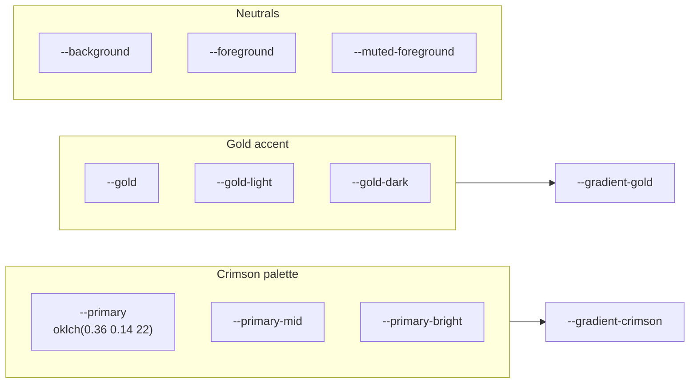
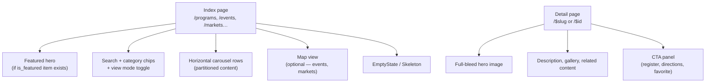

# JESUP Design System

**Document status:** UI/UX reference  
**Version:** 1.0  
**Last updated:** July 2026  
**Source files:** `src/styles.css`, `src/components/design-system/`

---

## Table of contents

1. [Design principles](#1-design-principles)
2. [Color system](#2-color-system)
3. [Typography](#3-typography)
4. [Spacing & layout](#4-spacing--layout)
5. [Shadows & effects](#5-shadows--effects)
6. [CSS utilities](#6-css-utilities)
7. [Components](#7-components)
8. [Domain patterns](#8-domain-patterns)
9. [Admin (Command Center) UI](#9-admin-command-center-ui)
10. [Coding standards](#10-coding-standards)

---

## 1. Design principles

JESUP should feel like a **premium mobile application** — not a traditional university website.

| Principle | Guideline |
|-----------|-----------|
| **Mobile-first** | Design for phone screens first; scale up with `@media (min-width: 640px)` |
| **Crimson + gold** | Tuskegee heritage via crimson gradients; gold for accents only |
| **Large imagery** | Hero images, 16:10 cards, full-bleed carousels |
| **Motion** | Subtle `animate-fade-up`, pull-to-refresh, hover lift |
| **Glass surfaces** | Frosted overlays on hero content and map controls |
| **Horizontal discovery** | `HorizontalScroll` carousels for section rows |
| **Accessibility** | Semantic HTML, ARIA labels on sections, touch-friendly 44px targets |

**Inspiration:** Apple (clarity), Nike (energy), Airbnb (discovery), Spotify (media), modern native apps.

---

## 2. Color system

Defined in `src/styles.css` using **OKLCH** color space.



### Token reference

| Token | Light mode | Usage |
|-------|------------|-------|
| `--primary` | Deep crimson | Buttons, headings, brand marks |
| `--primary-mid` | Mid crimson | Gradient stops |
| `--primary-bright` | Bright crimson | Gradient highlights |
| `--gold` / `--accent` | Metallic gold | Badges, dividers, eyebrow text, icons |
| `--background` | Off-white | Page background |
| `--foreground` | Near-black | Body text |
| `--muted-foreground` | Gray | Secondary text |
| `--card` | White | Card surfaces |
| `--secondary` | Light gray | Skeletons, chip backgrounds |
| `--destructive` | Red | Errors, delete actions |

### Gradients

| Utility class | CSS variable | Usage |
|---------------|--------------|-------|
| `grad-crimson` | `--gradient-crimson` | Hero fallbacks, buttons, chips |
| `grad-gold-text` | `--gradient-gold` | Eyebrow labels ("CISC Extension") |
| `grad-crimson-text` | `--gradient-crimson` | Text gradient headlines |

### Dark mode

Dark tokens are defined under `.dark` in `styles.css`. `ThemeProvider` (`src/lib/theme.tsx`) toggles the class. Command Center uses light mode by default.

---

## 3. Typography

| Token | Size | Usage |
|-------|------|-------|
| `--text-xs` | 0.6875rem | Eyebrows, badges |
| `--text-sm` | 0.8125rem | Captions, meta |
| `--text-base` | 1rem | Body |
| `--text-lg` – `--text-5xl` | 1.125–3rem | Headings |

**Font family:** Inter (loaded via `@fontsource/inter`) — weights 400–900.

| Style | Classes | Usage |
|-------|---------|-------|
| Display headline | `text-4xl font-black tracking-[var(--tracking-tight)]` | Page titles |
| Section title | `text-2xl font-black` | Section headers |
| Eyebrow | `text-eyebrow grad-gold-text` | Category labels |
| Body | `text-base text-muted-foreground` | Descriptions |

**Tracking:** `--tracking-tight: -0.02em` for headlines; `--tracking-eyebrow: 0.18em` for uppercase labels.

---

## 4. Spacing & layout

### Page shell

| Token | Mobile | Desktop (≥640px) |
|-------|--------|------------------|
| `--page-px` | 1rem | 1.5rem |
| `--page-py` | 2rem | 3rem |
| `--section-gap` | 1.5rem | 2rem |
| `--bottom-nav-offset` | 6rem | — (safe area for bottom nav) |

### Layout components

| Component | Purpose |
|-----------|---------|
| `PageContainer` | Max-width wrapper (`size: sm | md | lg`) |
| `pb-bottom-nav` | Bottom padding for mobile tab bar |
| `page-x` / `page-y` | Inline/block page padding utilities |

### Radius

| Token | Value |
|-------|-------|
| `--radius` | 1.25rem (base) |
| `--radius-2xl` | ~2rem | Cards, hero sections |
| `--btn-radius` | 9999px (pill buttons) |

---

## 5. Shadows & effects

| Utility | Variable | Usage |
|---------|----------|-------|
| `shadow-token-soft` | `--shadow-soft` | Default cards |
| `shadow-token-lift` | `--shadow-lift` | Hover states, featured cards |
| `shadow-token-crimson` | `--shadow-crimson` | Hero sections, primary CTAs |
| `glass-surface` | Frosted white overlay | Map controls, pull-refresh indicator |
| `glass-surface-dark` | Frosted dark overlay | Hero badges on images |
| `gold-bar` | 2px gold gradient line | Admin/page headers |
| `gold-divider` | Horizontal gold fade | Section separators |

### Animation

| Utility | Effect |
|---------|--------|
| `animate-fade-up` | Entrance animation with staggered `animation-delay` |
| `animate-shimmer` | Skeleton loading pulse |

---

## 6. CSS utilities

All defined in `src/styles.css` under `@utility` (Tailwind CSS 4).

```css
/* Signature patterns used across modules */
grad-crimson          /* Crimson gradient background */
glass-surface         /* Frosted glass card overlay */
gold-divider          /* Section separator */
text-eyebrow          /* Uppercase gold label */
pb-bottom-nav         /* Mobile bottom nav safe area */
shadow-token-lift     /* Elevated card shadow */
animate-fade-up       /* Staggered entrance */
```

Use **design token utilities** instead of arbitrary Tailwind values for shadows and gradients to maintain consistency.

---

## 7. Components

Exported from `src/components/design-system/index.ts`.

### Primitives

| Component | Variants / props | Use for |
|-----------|------------------|---------|
| `AppButton` | `primary`, `outline`, `inverse`, `ghost`; `pill` shape | All public CTAs |
| `AppCard` | `elevated`, `lift`; `padding: none/sm/md` | Content cards |
| `AppBadge` | `gold`, `outline` | SNAP/EBT, status chips |
| `PageContainer` | `size: sm/md/lg` | Page width constraint |
| `SectionHeader` | `title`, `titleId`, `action` | Section headings with optional link |
| `EmptyState` | `icon`, `title`, `description`, `action` | Zero-data states |
| `LoadingState` | Skeleton grids | Initial page load |
| `HorizontalScroll` | `gap: md` | Carousel rows |
| `HorizontalScrollItem` | `width: md` | Fixed-width carousel cards |
| `HeroBanner` | Full-bleed hero | Legacy hero pattern |
| `HomeSection` | `meta`, `sectionId` | Home page sections |
| `QuickActionTile` | Icon + label | Home quick actions |
| `StatGrid` | Impact metrics | Community impact section |
| `BrandMark` | JESUP logo mark | Nav branding |
| `CrimsonPanel` | Branded panel | CTA sections |

### shadcn/ui (`src/components/ui/`)

Use shadcn for **admin and form UI** only:

- `Dialog`, `Table`, `Input`, `Select`, `Tabs`, `Sidebar`
- `Checkbox`, `Switch`, `Textarea`, `Skeleton`

**Rule:** On public pages, prefer `AppButton` / `AppCard` / `AppBadge` over raw shadcn `Button` / `Card` / `Badge`.

---

## 8. Domain patterns

Each content module follows the same UI structure:



### Reusable domain components

| Module | Components path | Key components |
|--------|-----------------|----------------|
| Programs | `src/components/programs/` | `ProgramCard`, `ProgramFilters`, `FeaturedProgramHero`, `ProgramsPullRefresh` |
| Events | `src/components/events/` | `EventCard`, `EventFilters`, `EventMapView`, `EventCalendarView` |
| Markets | `src/components/markets/` | `MarketCard`, `MarketMapView`, `FeaturedMarketHero` |
| Publications | `src/components/publications/` | `PublicationCard`, `PublicationFilters` |
| Home | `src/components/home/` | `HomeHero`, `FarmersMarketsHomeSection`, section rows |

### Card anatomy (standard)

```
┌─────────────────────────────┐
│  16:10 cover image          │  ← aspect-[16/10], hover scale
│  [badge]          [bookmark]│  ← glass-surface overlays
├─────────────────────────────┤
│  Category chips             │  ← AppBadge
│  Title (font-black)         │
│  Meta (MapPin, Clock…)      │
│  [View CTA pill button]     │  ← AppButton outline
└─────────────────────────────┘
```

### Pull-to-refresh

Implemented via `usePullToRefresh` hook + module-specific wrapper (`EventsPullRefresh`, `MarketsPullRefresh`, `ProgramsPullRefresh`).

---

## 9. Admin (Command Center) UI

Command Center uses a **hybrid** of design system tokens and shadcn admin components.

| Element | Implementation |
|---------|----------------|
| Sidebar | shadcn `Sidebar` + `COMMAND_CENTER_NAV` from `src/modules/admin/config/nav-items.ts` |
| Page header | `CommandCenterPageHeader` — gold bar + serif title |
| Content area | `CommandCenterContentShell` — `max-w-7xl` centered |
| Data tables | shadcn `Table` |
| Forms | shadcn `Dialog` + `Tabs` (e.g. `EventFormDialog`, `MarketFormDialog`) |
| Dashboard | `DashboardWidgets` — grouped metric cards |

Admin branding: **"JESUP Command Center"** (not "Admin Dashboard").

---

## 10. Coding standards

### Component rules

1. **Use design system on public pages** — `AppButton`, `AppCard`, `AppBadge`, `PageContainer`
2. **Colocate domain UI** — market components in `src/components/markets/`, not generic folders
3. **Export via barrel** — each domain folder has `index.ts`
4. **No hardcoded content** — all copy from CMS queries or `section-config.ts`
5. **Images** — always `loading="lazy"` except hero `fetchPriority="high"`

### Styling rules

1. **Tailwind 4** with `@theme inline` tokens — extend via `styles.css`, not scattered magic numbers
2. **cn() helper** — `src/lib/utils.ts` for conditional classes
3. **CVA variants** — `appButtonVariants`, `appCardVariants` for component APIs
4. **Responsive** — mobile-first; test at 375px width minimum

### File naming

| Type | Convention | Example |
|------|------------|---------|
| Components | `kebab-case.tsx` | `market-card.tsx` |
| Hooks | `use-*.ts` | `use-favorite-markets.ts` |
| Services | `kebab-case.ts` | `market-geo.ts` |
| Routes | TanStack file convention | `markets.$id.tsx` |

### Accessibility

- Section headings use `aria-labelledby` with matching `titleId`
- Icon-only buttons require `aria-label`
- Skeleton loaders use `role="status"` and `aria-label`
- Color contrast: crimson on white and white on crimson both meet WCAG AA for large text

---

## Document control

| Version | Date | Changes |
|---------|------|---------|
| 1.0 | July 2026 | Initial design system reference |

**See also:** [Product Spec](./JESUP_PRODUCT_SPEC_V1.md) · [System Architecture](./SYSTEM_ARCHITECTURE.md)
