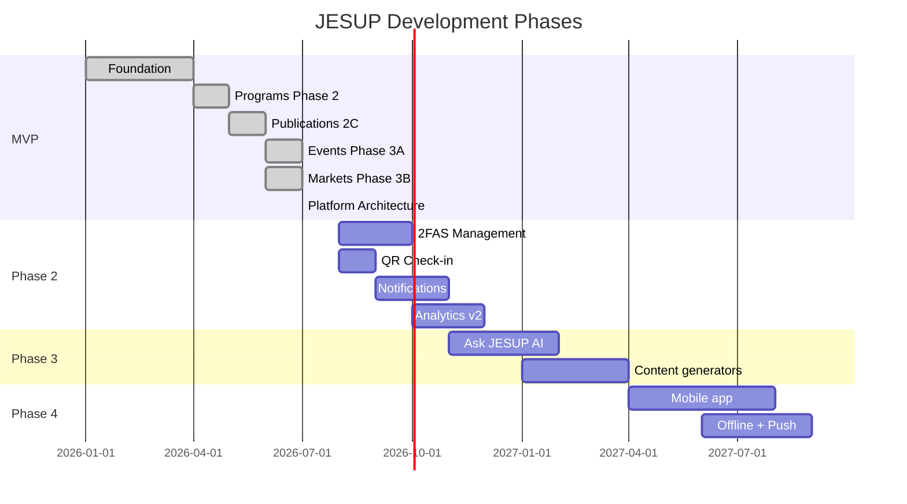

# JESUP Development Roadmap

**Document status:** Delivery plan  
**Version:** 1.0  
**Last updated:** July 2026  
**Source of truth:** Current codebase + [Product Spec](./JESUP_PRODUCT_SPEC_V1.md)

---

## Overview

---

## MVP — Complete ✅

The MVP foundation is **live in the codebase**. All items below have public routes, admin management, and database schema.

| Feature | Public route | Admin route | Service module | Migration |
|---------|-------------|-------------|----------------|-----------|
| Authentication | `/auth` | — | `use-auth.ts` | Initial schema |
| User profile | `/me` | — | — | Initial schema |
| Home dashboard | `/` | — | `src/lib/home/` | — |
| Programs | `/programs` | `/admin/programs` | `src/lib/programs.ts` | Phase 2B |
| Publications | `/publications` | `/admin/publications` | `src/lib/publications.ts` | Phase 2C |
| Events | `/events` | `/admin/events` | `src/lib/events.ts` | Phase 3A |
| Farmers markets | `/markets` | `/admin/markets` | `src/lib/markets.ts` | Phase 3B |
| Equipment checkout | `/equipment` | `/admin/equipment` | Inline route | Initial schema |
| Surveys | `/surveys` | `/admin/surveys` | Inline route | Initial schema |
| Partners | `/partners` | `/admin/partners` | Inline route | Initial schema |
| Grants | `/grants` | `/admin/grants` | Inline route | Initial schema |
| Podcast | `/podcast` | `/admin/podcast` | Inline route | Initial schema |
| Internships / 2FAS listings | `/internships` | `/admin/internships` | Inline route | Initial schema |
| Donations | `/donate` | — | Inline route | — |
| JESUP Command Center | — | `/admin` | `src/modules/admin/` | Platform arch |
| Media library | — | `/admin/media` | `src/modules/cms/media.ts` | Platform arch |
| Global search | — | `/admin/search` | `src/modules/cms/search.ts` | — |
| Notifications (in-app) | — | `/admin/notifications` | `src/modules/notifications/` | Platform arch |
| Settings | — | `/admin/settings` | `src/modules/settings/` | Platform arch |
| Analytics | — | `/admin/analytics` | `src/modules/admin/services/dashboard.ts` | — |

### MVP architecture milestones (completed)

- [x] Premium mobile UI for programs, events, markets, publications
- [x] JESUP design system (`src/components/design-system/`)
- [x] Modular platform (`src/modules/`)
- [x] CMS relationship engine (junction tables + `AttachmentPicker`)
- [x] RLS security model with `has_role()` fix
- [x] Category admin RPCs (`create_program_category`, `create_publication_category`)
- [x] Storage buckets for all media types
- [x] Documentation suite (`/docs`)

---

## Phase 2 — Engagement & pipeline

**Goal:** Deepen user engagement and complete the 2FAS student development pipeline.

### 2A — 2FAS student management

| Task | Description | Depends on |
|------|-------------|------------|
| 2FAS public program page | Enhance `/programs/2fas` with track-specific content | CMS |
| Student portal | Dedicated `/me/2fas` progress view | Auth |
| Mentor assignment | Admin assigns mentors to applications | `internship_applications` schema extension |
| Evaluations | Structured evaluation forms per track | New tables |
| Progress tracking | Milestone checklist per student | New tables |
| Resume management | Improve resume upload UX | `resumes` bucket (exists) |

**Module target:** Expand `src/modules/internships/` and `src/modules/twofas/` (rename registry description from current stub).

### 2B — Event QR check-in

| Task | Description | Status |
|------|-------------|--------|
| QR code generation | Per-registration unique check-in code | `event_checkins` table exists |
| Scanner UI | Admin/mobile check-in interface | Not built |
| Attendance reporting | Per-event check-in analytics | Not built |

### 2C — Certificates

| Task | Description | Status |
|------|-------------|--------|
| Certificate templates | PDF generation per event/program | `event_certificates` table exists |
| Auto-issue on check-in | Trigger certificate after attendance | Not built |
| Public verification | Certificate URL validation | Not built |

### 2D — Notifications (delivery)

| Task | Description | Status |
|------|-------------|--------|
| In-app notifications | Create/read in Command Center | ✅ Live |
| Email delivery | Transactional email for registrations, approvals | Scaffolded (`channel = email`) |
| Push notifications | Firebase FCM integration | Planned |
| SMS | Twilio or similar for urgent alerts | Planned |
| User notification preferences | Opt-in/opt-out per channel | Not built |

### 2E — Analytics v2

| Task | Description | Status |
|------|-------------|--------|
| Dashboard widgets | Command Center counts | ✅ Live |
| Analytics page | Platform-wide metrics | ✅ Live |
| Engagement trends | Time-series charts (recharts in deps) | Not built |
| Export reports | CSV/PDF for Extension leadership | Not built |
| Geographic insights | Map-based reach from lat/lng data | Data exists, UI not built |

---

## Phase 3 — AI & intelligence

See [AI Roadmap](./AI_ROADMAP.md) for full detail.

| Feature | Priority | Prerequisite |
|---------|----------|--------------|
| Ask JESUP AI (chat) | High | Server-side AI proxy |
| Factsheet generator | Medium | Admin AI settings |
| Survey summarizer | Medium | Qualtrics data access |
| Impact report generator | Medium | Analytics v2 |
| Grant assistant | Low | Grants module + AI proxy |

---

## Phase 4 — Mobile & field

| Feature | Approach | Notes |
|---------|----------|-------|
| App store release | Capacitor wrap or React Native | Reuse `src/modules/` logic |
| Offline publications | Local cache (SQLite / IndexedDB) | Publications have `file_url` |
| Push notifications | Firebase FCM | See notification layer |
| Field tools | Agent data collection UI | New module |
| Food safety guidance | Interactive shelf-life tool | New module, content-driven |

---

## Technical debt & refactors

Tracked improvements that support future phases:

| Item | Priority | Notes |
|------|----------|-------|
| Extract inline admin routes | Medium | grants, partners, surveys → domain libs |
| Physical module migration | Low | Move `src/lib/events.ts` → `src/modules/events/lib/` |
| Home sections CMS table | Low | Replace `section-config.ts` defaults with DB |
| Global public search | Medium | Extend `globalSearch()` to public nav |
| `twofas` registry label fix | Low | Code says "two-factor auth" — should say "2FAS program" |
| Event categories admin RPC | Low | Mirror `create_program_category` pattern |
| Automated migration CI | Medium | Supabase CLI in GitHub Actions |

---

## Module maturity matrix

| Module | Public UI | Admin UI | Domain lib | Tests | AI-ready |
|--------|-----------|----------|------------|-------|----------|
| Programs | ✅ Premium | ✅ Form dialog | ✅ | — | ✅ |
| Events | ✅ Premium | ✅ Form dialog | ✅ | — | ✅ |
| Markets | ✅ Premium | ✅ Form dialog | ✅ | — | ✅ |
| Publications | ✅ Premium | ✅ Form dialog | ✅ | — | ✅ |
| Podcast | ✅ Basic | ✅ Inline CRUD | — | — | ✅ |
| Partners | ✅ Basic | ✅ Inline CRUD | — | — | — |
| Grants | ✅ Basic | ✅ Inline CRUD | — | — | ✅ |
| Equipment | ✅ Basic | ✅ Inline CRUD | — | — | — |
| Surveys | ✅ Basic | ✅ Inline CRUD | — | — | — |
| Internships/2FAS | ✅ Basic | ✅ Inline CRUD | — | — | — |
| Donations | ✅ Static | — | — | — | — |
| Command Center | — | ✅ Full | ✅ | — | — |
| CMS platform | — | ✅ Partial | ✅ | — | ✅ |
| AI | — | Settings only | Stub | — | — |

---

## How to contribute to the roadmap

1. Pick a Phase 2+ item from this document.
2. Create a migration if schema changes are needed.
3. Add service functions in `src/lib/` or `src/modules/`.
4. Build UI in `src/components/` and route in `src/routes/`.
5. Update `src/integrations/supabase/types.ts`.
6. Update relevant `/docs` file.
7. Verify with `npm run build`.

---

## Document control

| Version | Date | Changes |
|---------|------|---------|
| 1.0 | July 2026 | Initial development roadmap |

**See also:** [Product Spec](./JESUP_PRODUCT_SPEC_V1.md) · [AI Roadmap](./AI_ROADMAP.md) · [Deployment Guide](./DEPLOYMENT_GUIDE.md)
