# JESUP System Architecture

> **Canonical location:** [docs/SYSTEM_ARCHITECTURE.md](./docs/SYSTEM_ARCHITECTURE.md)  
> This root file is a pointer. Edit the `docs/` copy.

**Document status:** Developer onboarding reference  
**Version:** 1.0  
**Last updated:** July 2026  
**Audience:** Engineers joining the JESUP project  
**Companion docs:** See [docs/README.md](./README.md) for the full documentation index.

---

## Table of contents

1. [Architecture at a glance](#1-architecture-at-a-glance)
2. [Frontend](#2-frontend)
3. [Backend](#3-backend)
4. [Database](#4-database)
5. [Authentication](#5-authentication)
6. [Storage](#6-storage)
7. [AI layer](#7-ai-layer)
8. [API layer](#8-api-layer)
9. [CMS layer](#9-cms-layer)
10. [Notification layer](#10-notification-layer)
11. [Analytics layer](#11-analytics-layer)
12. [Folder structure](#12-folder-structure)
13. [Data flow](#13-data-flow)
14. [Security model](#14-security-model)
15. [Deployment architecture](#15-deployment-architecture)
16. [Future mobile architecture](#16-future-mobile-architecture)
17. [Integration map](#17-integration-map)
18. [Developer quick start](#18-developer-quick-start)

---

## 1. Architecture at a glance

JESUP is a **full-stack React application** with **Supabase as the backend-as-a-service (BaaS)**. There is no custom Node/Express API server. The browser (and SSR worker) talk directly to Supabase for data, auth, and file storage. Business logic lives in TypeScript service modules; authorization is enforced by PostgreSQL Row Level Security (RLS).

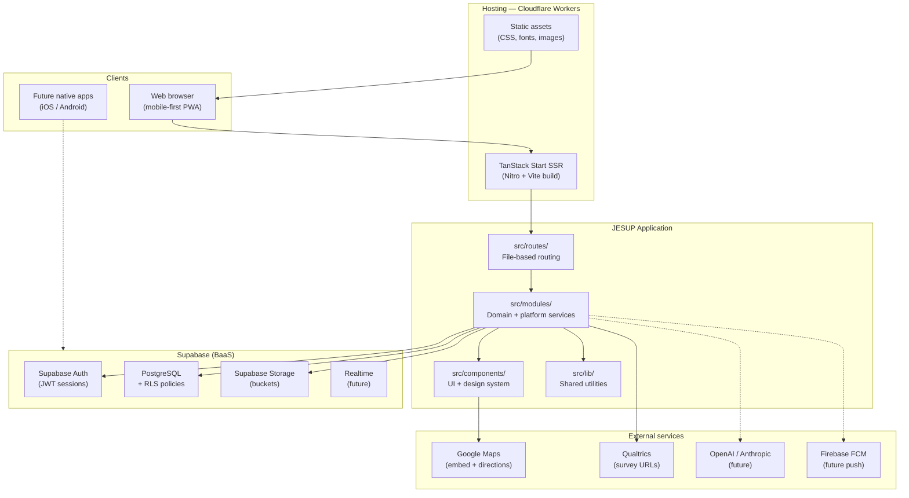

### Design principles

| Principle | Implementation |
|-----------|----------------|
| **CMS-driven** | All public content reads from Supabase tables — no hardcoded data |
| **Modular** | Domain logic organized under `src/modules/` with platform services (CMS, admin, notifications, settings) |
| **Mobile-first** | Premium UI via shared design system; bottom nav, pull-to-refresh, horizontal carousels |
| **Security by default** | RLS on every table; admin gated by `user_roles` + `has_role()` |
| **Route stability** | TanStack file routes in `src/routes/` are the URL contract — logic moves, routes stay |

---

## 2. Frontend

### Stack

| Technology | Version / role |
|------------|----------------|
| **React** | 19 — UI rendering |
| **TanStack Start** | Full-stack framework (routing + SSR) |
| **TanStack Router** | File-based routes, loaders, `beforeLoad` guards |
| **TanStack Query** | Server state, caching, refetch |
| **Tailwind CSS** | 4 — utility styling |
| **shadcn/ui** | Radix primitives + accessible components |
| **Vite** | Build tool (via `@lovable.dev/vite-tanstack-config`) |
| **TypeScript** | Strict typing across app and generated DB types |

### Rendering model

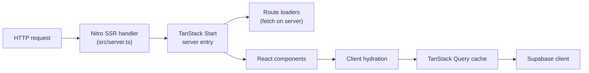

- **SSR:** Most public pages render on the server via TanStack Start + Nitro.
- **CSR islands:** Authenticated admin routes set `ssr: false` and run client-only (sidebar, forms, uploads).
- **Loaders:** Detail pages (e.g. `/events/$id`, `/markets/$id`) prefetch data in route loaders.

### UI layers

| Layer | Path | Purpose |
|-------|------|---------|
| **Design system** | `src/components/design-system/` | JESUP-branded primitives (AppCard, AppButton, PageContainer, etc.) |
| **shadcn/ui** | `src/components/ui/` | Low-level accessible components (Dialog, Table, Sidebar, etc.) |
| **Domain components** | `src/components/{programs,events,markets,publications}/` | Module-specific cards, filters, detail sections |
| **Layouts** | `src/components/public-layout.tsx`, `bottom-nav.tsx`, `public-nav.tsx` | Public shell |
| **Command Center** | `src/modules/admin/components/` | Admin sidebar, dashboard widgets, page headers |

### State management

| Concern | Tool |
|---------|------|
| Server/async data | TanStack Query (`useQuery`, `useMutation`) |
| Auth session | `useAuth` hook + Supabase `onAuthStateChange` |
| URL state | TanStack Router search params |
| Local persistence | `localStorage` (favorites, reminders, theme) |
| Forms | React Hook Form + Zod (admin dialogs) |

---

## 3. Backend

JESUP does **not** run a traditional application server. The “backend” is **Supabase** plus **client-side service modules**.

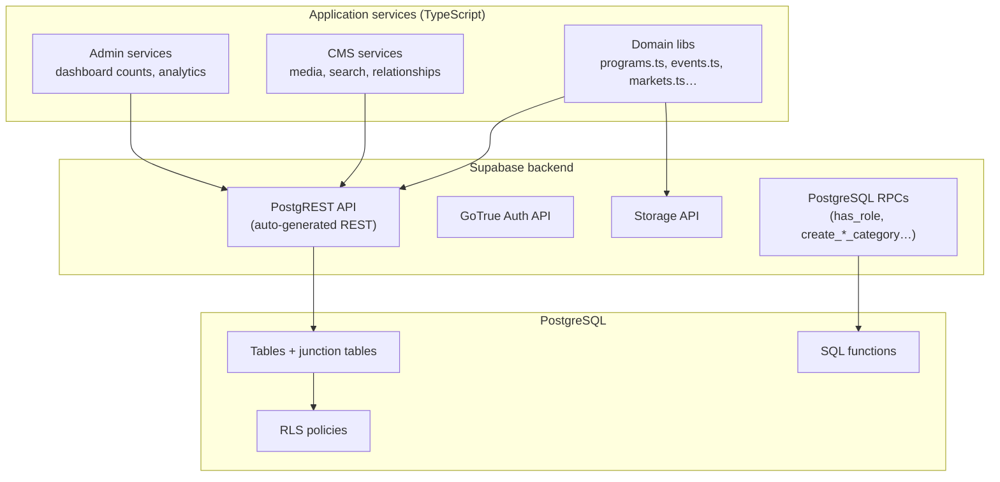

### Service module pattern (rich domains)

Files like `src/lib/events.ts` and `src/lib/markets.ts` follow a consistent pattern:

1. **Types** — TypeScript interfaces mirroring DB rows (camelCase)
2. **Fetch** — `fetch*()` for public lists and detail views
3. **Filter / partition** — Client-side search and section grouping
4. **Admin** — `fetchAdmin*()`, `save*()`, `delete*()`
5. **Relations** — Junction table delete-all + re-insert on save
6. **Uploads** — `upload*Image()` → Supabase Storage → public URL

### SSR entry point

`src/server.ts` wraps TanStack Start’s server entry with error capture and HTML error pages for catastrophic SSR failures. Configured in `vite.config.ts`:

```ts
tanstackStart: { server: { entry: "server" } }
```

### Server middleware (future API routes)

`src/integrations/supabase/auth-middleware.ts` exports `requireSupabaseAuth` — a TanStack Start middleware that validates Bearer JWTs for protected server functions. Use this when adding server-only API endpoints that must not expose secrets to the browser.

---

## 4. Database

### Engine

**PostgreSQL 15+** hosted by Supabase, with schema managed via SQL migrations in `supabase/migrations/`.

### Schema overview

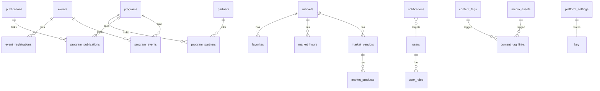

### Core tables by domain

| Domain | Primary tables | Junction / child tables |
|--------|----------------|-------------------------|
| **Programs** | `programs`, `program_categories` | `program_events`, `program_publications`, `program_partners`, `program_grants`, `program_podcast_episodes` |
| **Events** | `events`, `event_categories` | `event_partners`, `event_grants`, `event_podcast_episodes`, `event_registrations`, `event_sessions`, `event_speakers` |
| **Markets** | `markets` | `market_hours`, `market_images`, `market_vendors`, `market_products`, `market_announcements`, `market_events`, `market_programs`, `favorites` |
| **Publications** | `publications`, `publication_categories` | `publication_events`, `publication_podcast_episodes` |
| **Platform** | `media_assets`, `content_tags`, `platform_settings`, `notifications` | `content_tag_links` |
| **Auth** | `profiles`, `user_roles` | — |
| **Operations** | `equipment`, `equipment_checkouts`, `internships`, `internship_applications`, `surveys`, `grants`, `partners`, `podcast_episodes` | — |

### Migrations

Apply manually via **Supabase SQL Editor** (project convention):

```
supabase/migrations/
├── 20260708002*_*.sql          # Initial schema
├── 202607081*_programs_*.sql   # Programs phases
├── 202607081*_publications_*.sql
├── 202607082*_events_*.sql     # Events phase 3A
├── 20260708300000_markets_phase3b.sql
└── 20260708310000_platform_architecture.sql
```

### Generated types

`src/integrations/supabase/types.ts` — TypeScript `Database` type generated from schema. Import as:

```ts
import type { Database } from "@/integrations/supabase/types";
```

Keep this file updated when adding migrations.

---

## 5. Authentication

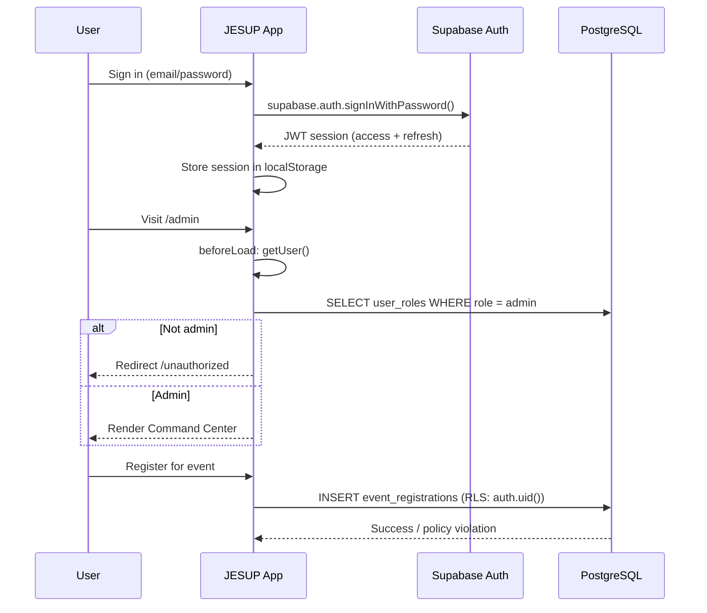

### Components

| Piece | Location | Role |
|-------|----------|------|
| **Supabase client** | `src/integrations/supabase/client.ts` | Browser auth with `persistSession: true` |
| **useAuth hook** | `src/hooks/use-auth.ts` | Session state + `isAdmin` from `user_roles` |
| **`_authenticated` layout** | `src/routes/_authenticated/route.tsx` | Redirects unauthenticated users to `/auth` |
| **Admin layout** | `src/routes/_authenticated/admin/route.tsx` | Requires `admin` role |
| **Auth middleware** | `src/integrations/supabase/auth-middleware.ts` | Bearer JWT validation for server functions |
| **Auth redirect** | `src/lib/auth-redirect.ts` | Preserves `?next=` return path after login |

### Roles

| Role | Table | Capabilities |
|------|-------|--------------|
| `user` | `user_roles` | Register, apply, checkout, view `/me` |
| `admin` | `user_roles` | Full JESUP Command Center access |

Role checks in RLS use `public.has_role(auth.uid(), 'admin')` — a SECURITY DEFINER function.

---

## 6. Storage

### Buckets

| Bucket | Public | Purpose |
|--------|--------|---------|
| `publications` | Yes | PDFs, factsheets, magazine files |
| `market-images` | Yes | Market covers, gallery, vendor logos |
| `event-images` | Yes | Event covers and gallery |
| `equipment-images` | Yes | Equipment photos |
| `partner-logos` | Yes | Partner branding |
| `podcast-images` | Yes | Episode cover art |
| `media-library` | Yes | Global CMS media assets |
| `resumes` | **No** | 2FAS / internship application resumes (user-scoped) |

### Upload flow

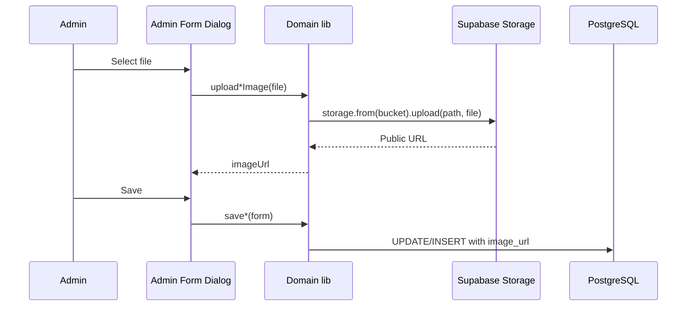

### Policies

- **Public buckets:** `SELECT` for `anon` + `authenticated`; `INSERT/UPDATE/DELETE` for admins only.
- **Resumes bucket:** Users can upload/update only within their own folder (`auth.uid()` path prefix).

---

## 7. AI layer

**Status: Planned (Phase 3)** — scaffold exists; not yet wired to external APIs.

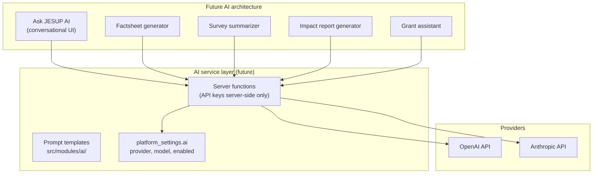

### Current state

| Item | Status |
|------|--------|
| `src/modules/ai/` | Module stub + settings schema |
| `platform_settings.ai` | `{ enabled: false, provider: null }` |
| Command Center AI settings | `/admin/settings` → AI section |
| Server-side proxy | **Not implemented** — required before any API key use |

### Implementation guidance (for future developers)

1. **Never** put OpenAI/Anthropic API keys in `VITE_*` env vars — they would ship to the browser.
2. Add TanStack Start **server functions** with `requireSupabaseAuth` middleware.
3. Gate AI features behind `platform_settings.ai.enabled` and admin role.
4. Log prompts and responses for audit (new `ai_interactions` table recommended).

---

## 8. API layer

JESUP uses **three API surfaces** — not a monolithic REST server.

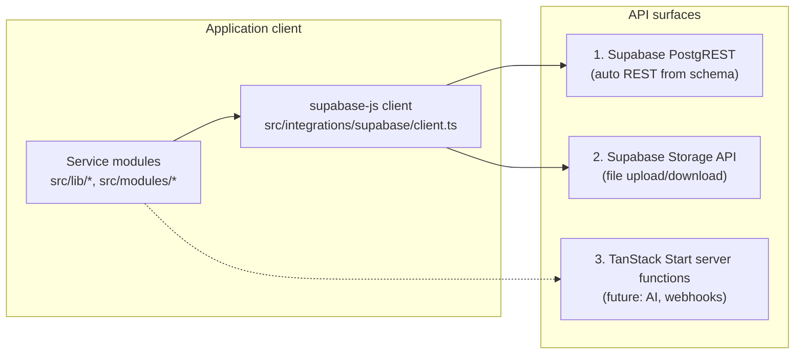

### PostgREST (primary)

All CRUD goes through `@supabase/supabase-js`:

```ts
const { data, error } = await supabase
  .from("programs")
  .select("*")
  .eq("is_active", true);
```

RLS policies enforce authorization — the client uses the **anon/publishable key** safely because Postgres rejects unauthorized rows.

### RPC functions

Complex or privileged operations use PostgreSQL functions:

| Function | Purpose |
|----------|---------|
| `has_role(user_id, role)` | RLS policy helper |
| `create_program_category(name)` | Admin category creation (SECURITY DEFINER) |
| `create_publication_category(name)` | Admin category creation (SECURITY DEFINER) |
| `get_event_registration_count(event_id)` | Registration counts |

### Server functions (extensibility point)

When you need secrets, webhooks, or third-party APIs, add TanStack Start server routes/functions that:

1. Use `requireSupabaseAuth` or admin role checks
2. Call external APIs with server-only env vars
3. Return sanitized responses to the client

---

## 9. CMS layer

The CMS is **not a separate product** — it is the combination of Supabase tables, the JESUP Command Center UI, and platform services in `src/modules/cms/`.

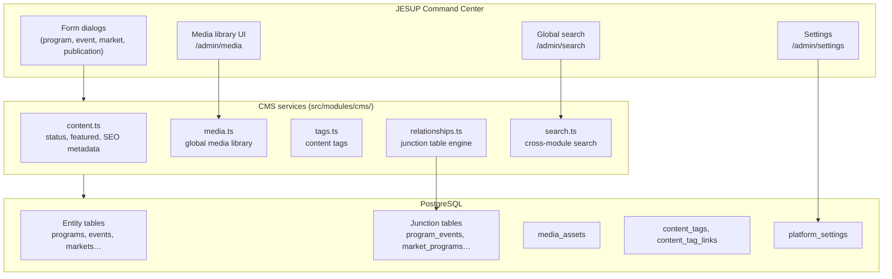

### Unified content capabilities

| Capability | Service | Storage |
|------------|---------|---------|
| **Images / documents** | `media.ts` + domain upload helpers | Supabase Storage + `media_assets` |
| **Rich text** | `rich-text-editor.tsx` | HTML in entity `description` columns |
| **Tags** | `tags.ts` | `content_tags`, `content_tag_links` |
| **Categories** | Domain libs (`program_categories`, etc.) | Per-entity category tables |
| **Featured items** | `content.ts` + `is_featured` columns | Entity tables |
| **Status** | `is_active`, `status`, `is_published` columns | Entity tables |
| **SEO** | `content.ts` + `metadata` JSONB | Entity `metadata` or dedicated columns |
| **Relationships** | `relationships.ts` + `AttachmentPicker` | Junction tables |
| **Search** | `search.ts` | Client-side query across tables |

### Relationship engine

`RELATIONSHIP_REGISTRY` in `src/modules/cms/relationships.ts` maps entity pairs to junction tables. Admins connect content in form dialogs without code changes.

Example chain:

```
Programs → Events → Publications → Podcast Episodes → Partners → Grants → Markets
```

---

## 10. Notification layer

**Status:** In-app notifications live; push/email/SMS planned.

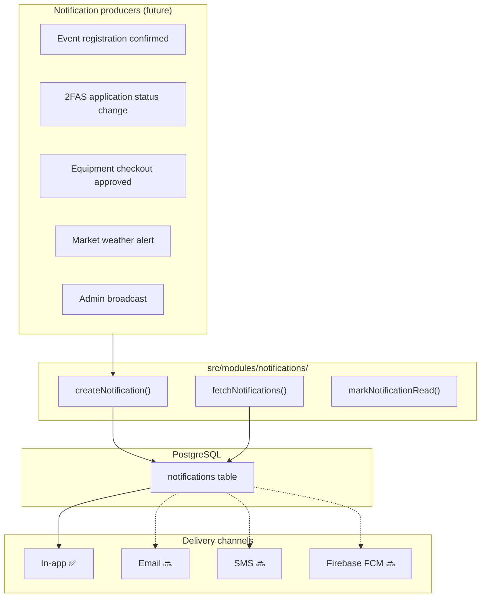

### Admin UI

`/admin/notifications` — create and manage in-app notifications. Channel field supports `in_app | email | sms | push`; only `in_app` is active today.

### Future implementation

1. Add a **notification worker** (Supabase Edge Function or server function) that polls `status = pending` rows.
2. Integrate **Firebase FCM** for mobile push (see [Future mobile architecture](#16-future-mobile-architecture)).
3. Integrate **transactional email** (Resend, SendGrid, or Supabase Auth emails) for `channel = email`.

---

## 11. Analytics layer

```mermaid
flowchart LR
    subgraph Sources["Data sources"]
        Programs["programs"]
        Events["events + event_registrations"]
        Markets["markets + favorites"]
        Media["media_assets"]
        Users["profiles"]
        Checkouts["equipment_checkouts\n+ internship_applications"]
    end

    subgraph AnalyticsService["src/modules/admin/services/dashboard.ts"]
        Counts["fetchDashboardCounts()"]
        Summary["fetchAnalyticsSummary()"]
    end

    subgraph UI["Command Center UI"]
        Dashboard["/admin dashboard widgets"]
        Analytics["/admin/analytics"]
    end

    Sources --> AnalyticsService
    AnalyticsService --> UI
```

### Current metrics

| Metric | Source |
|--------|--------|
| Active programs, events, markets, publications | `COUNT(*)` with `is_active` / `is_published` filters |
| Event registrations | `event_registrations` count |
| Pending approvals | `equipment_checkouts` + `internship_applications` where `status = pending` |
| Users | `profiles` count |
| Media assets | `media_assets` count |
| Favorites | `favorites` count |

### Future analytics (Phase 2+)

- Page view tracking (privacy-respecting analytics)
- Registration funnels and conversion rates
- Geographic heat maps (market/event coordinates)
- AI-generated impact reports (Phase 3)
- Export to CSV/PDF for Extension reporting

---

## 12. Folder structure

```
jesup-by-cisc/
├── JESUP_PRODUCT_SPEC_V1.md      # Product master reference
├── SYSTEM_ARCHITECTURE.md        # This document
├── package.json
├── vite.config.ts                # Lovable TanStack config (do not duplicate plugins)
├── src/
│   ├── server.ts                 # SSR error wrapper entry
│   ├── styles.css                # Tailwind 4 + JESUP design tokens
│   ├── assets/jesup/             # Static brand assets
│   │
│   ├── routes/                   # ★ URL contract — TanStack file routes
│   │   ├── __root.tsx            # Root layout, QueryClient, theme
│   │   ├── index.tsx             # Home page
│   │   ├── auth.tsx
│   │   ├── programs.tsx, programs.$slug.tsx
│   │   ├── events.index.tsx, events.$id.tsx
│   │   ├── markets.tsx, markets.$id.tsx
│   │   ├── publications.tsx, publications.$slug.tsx
│   │   ├── podcast.tsx, partners.tsx, grants.tsx
│   │   ├── equipment.tsx, surveys.tsx, internships.tsx, donate.tsx
│   │   ├── resources.tsx, unauthorized.tsx
│   │   ├── _authenticated/
│   │   │   ├── route.tsx         # Auth gate
│   │   │   ├── me.tsx            # User profile / activity
│   │   │   └── admin/            # JESUP Command Center
│   │   │       ├── route.tsx     # Admin role gate + sidebar layout
│   │   │       ├── index.tsx     # Dashboard widgets
│   │   │       ├── programs.tsx, events.tsx, markets.tsx …
│   │   │       ├── media.tsx, search.tsx, notifications.tsx
│   │   │       ├── settings.tsx, analytics.tsx, users.tsx
│   │   │       └── …
│   │   └── routeTree.gen.ts      # Auto-generated — do not edit
│   │
│   ├── modules/                  # ★ Platform architecture (Phase 3)
│   │   ├── core/                 # Module registry, types
│   │   ├── cms/                  # Media, search, relationships, tags, content
│   │   ├── admin/                # Command Center layout, nav, dashboard
│   │   ├── notifications/        # Notification service
│   │   ├── settings/             # Platform settings service
│   │   ├── analytics/            # Analytics exports
│   │   ├── ai/                   # AI stub (future)
│   │   ├── programs/             # Domain barrel (re-exports lib + components)
│   │   ├── events/, markets/, publications/ …
│   │   └── index.ts
│   │
│   ├── lib/                      # Domain services + shared utilities
│   │   ├── programs.ts, events.ts, markets.ts, publications.ts
│   │   ├── market-geo.ts, event-calendar.ts
│   │   ├── home/                 # Home page queries and section config
│   │   ├── navigation.ts, format.ts, csv.ts, utils.ts
│   │   ├── theme.tsx, auth-redirect.ts
│   │   └── error-capture.ts, error-page.ts
│   │
│   ├── components/
│   │   ├── design-system/        # JESUP UI primitives
│   │   ├── ui/                     # shadcn/ui components
│   │   ├── programs/, events/, markets/, publications/
│   │   ├── home/                   # Home page sections
│   │   ├── admin/                  # Form dialogs, attachment picker
│   │   ├── public-layout.tsx, public-nav.tsx, bottom-nav.tsx
│   │   └── rich-text-editor.tsx
│   │
│   ├── hooks/
│   │   ├── use-auth.ts
│   │   ├── use-home-data.ts
│   │   ├── use-favorite-markets.ts, use-saved-events.ts
│   │   ├── use-user-location.ts, use-pull-to-refresh.ts
│   │   └── use-market-reminders.ts
│   │
│   └── integrations/
│       ├── supabase/
│       │   ├── client.ts           # Browser Supabase client
│       │   ├── types.ts            # Generated Database types
│       │   └── auth-middleware.ts  # Server JWT middleware
│       └── lovable/                # Lovable Cloud auth helpers
│
├── supabase/
│   └── migrations/               # SQL migrations (apply via SQL Editor)
│
└── .output/                      # Production build (Nitro → Cloudflare Workers)
    ├── public/                   # Static assets
    └── server/                   # SSR worker bundle (wrangler.json)
```

### Import conventions

| Alias | Resolves to |
|-------|-------------|
| `@/` | `src/` |
| `@/modules/*` | Platform and domain modules |
| `@/lib/*` | Domain services (legacy path, still valid) |
| `@/components/*` | UI components |

---

## 13. Data flow

### Public page load

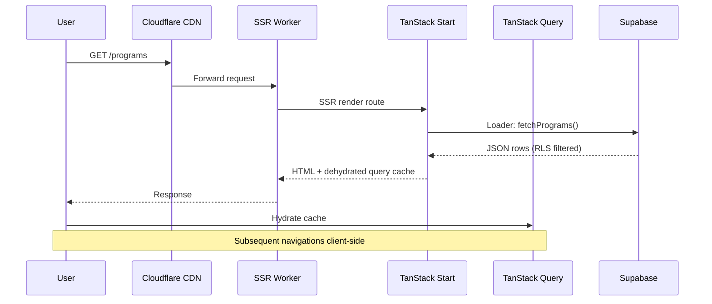

### Admin save flow

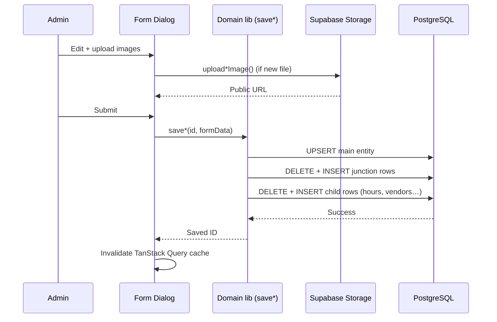

### Global search flow

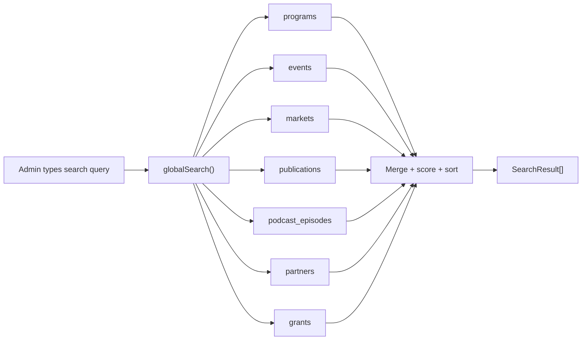

### Geolocation / maps flow

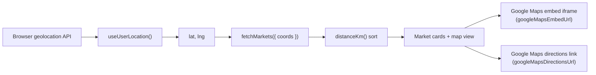

---

## 14. Security model

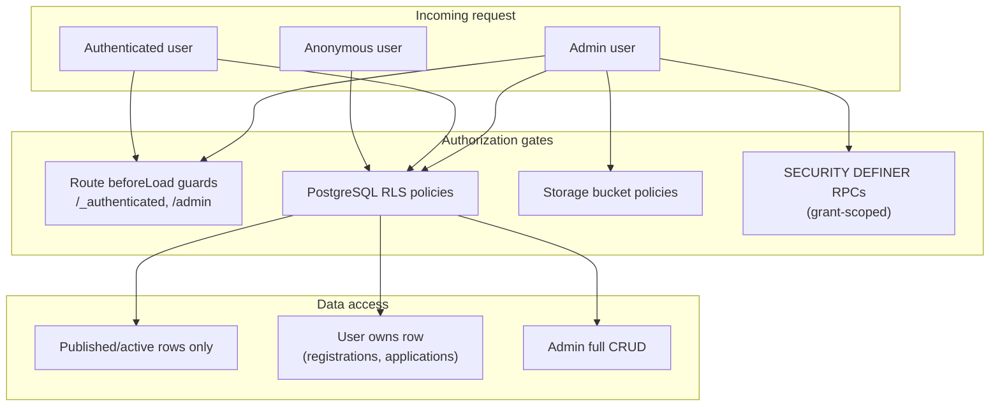

### RLS policy patterns

| Pattern | Example |
|---------|---------|
| **Public read (published)** | `USING (is_active = true)` on `programs`, `markets` |
| **Public read (published status)** | `USING (status = 'published')` on `events` |
| **User owns row** | `USING (auth.uid() = user_id)` on `event_registrations` |
| **Admin full access** | `USING (has_role(auth.uid(), 'admin'))` on admin-managed tables |
| **Anon execute for RLS** | `GRANT EXECUTE ON FUNCTION has_role TO anon` |

### Environment variables

| Variable | Exposure | Purpose |
|----------|----------|---------|
| `VITE_SUPABASE_URL` | Client (build-time) | Supabase project URL |
| `VITE_SUPABASE_PUBLISHABLE_KEY` | Client (build-time) | Anon/publishable key (RLS-protected) |
| `SUPABASE_URL` | Server only | SSR Supabase access |
| `SUPABASE_PUBLISHABLE_KEY` | Server only | SSR auth middleware |
| `OPENAI_API_KEY` *(future)* | **Server only** | AI proxy — never `VITE_` |
| `ANTHROPIC_API_KEY` *(future)* | **Server only** | AI proxy — never `VITE_` |

### Security checklist for new features

- [ ] Add RLS policies in a migration before exposing a new table
- [ ] Use `is_active` / `is_published` flags for public visibility
- [ ] Gate admin UI behind `/admin` `beforeLoad` + `user_roles`
- [ ] Never store API secrets in client env vars
- [ ] Use SECURITY DEFINER RPCs only with explicit `GRANT EXECUTE`
- [ ] Validate file upload types and sizes in admin forms

---

## 15. Deployment architecture

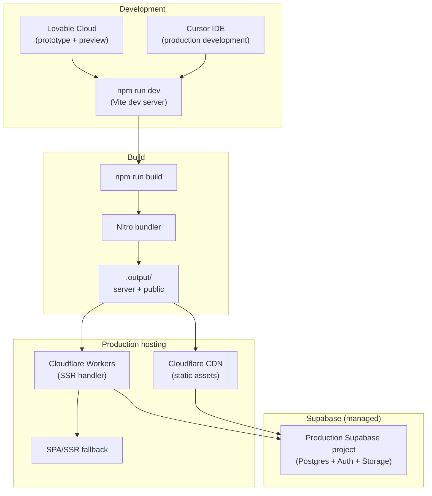

### Build pipeline

| Step | Command / output |
|------|------------------|
| Development | `npm run dev` — Vite + TanStack Start HMR |
| Production build | `npm run build` — Nitro bundles SSR worker |
| Output | `.output/server/` (Worker) + `.output/public/` (static) |
| Worker config | `.output/server/wrangler.json` — Cloudflare Workers target |
| Preview | `npm run preview` |

### Hosting notes

- Default build target is **Cloudflare Workers** (via `@lovable.dev/vite-tanstack-config` + Nitro).
- `src/server.ts` is the Worker entry — wraps SSR with error handling.
- Static assets (CSS, fonts, JS chunks) served from CDN binding.
- Supabase is **external** — not bundled; accessed over HTTPS at runtime.

### Environment setup

1. Connect Supabase in Lovable Cloud (sets `VITE_SUPABASE_*` vars).
2. Apply migrations in Supabase SQL Editor.
3. Create admin user + insert `user_roles` row with `role = admin`.
4. Build and deploy Worker + assets to Cloudflare (or Lovable publish flow).

---

## 16. Future mobile architecture

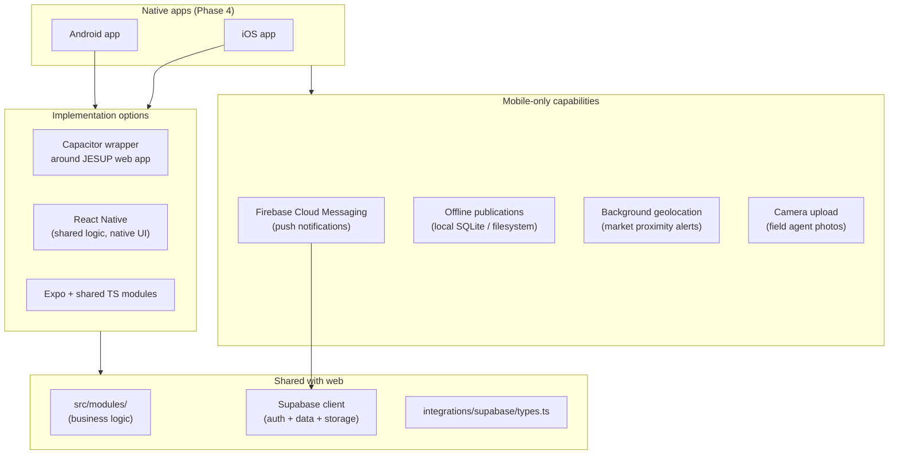

### Recommended approach

| Phase | Strategy |
|-------|----------|
| **Near-term** | PWA-capable web app (already mobile-first) — add manifest + service worker |
| **Phase 4** | **Capacitor** wrap for fastest app store path; reuse 100% of web UI |
| **Long-term** | Extract `src/modules/` into a shared package; React Native for native UX where needed |

### Shared logic boundaries

Move to a shared package (e.g. `packages/jesup-core/`):

- `modules/cms/` — search, relationships, content metadata
- `lib/markets.ts`, `lib/events.ts`, etc. — data fetching
- `integrations/supabase/types.ts` — database types
- `hooks/use-auth.ts` — auth state

Keep platform-specific:

- `src/routes/` — web routing (replace with React Navigation on mobile)
- `src/components/` — web UI (replace with native components)

### Offline strategy (Phase 4)

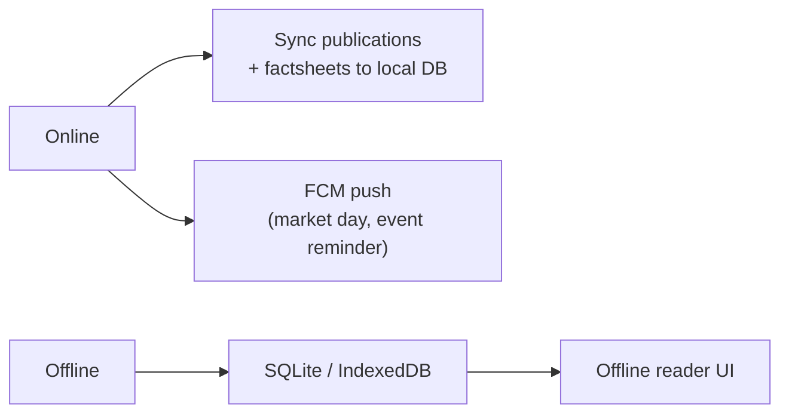

---

## 17. Integration map

How external tools and services fit together in the JESUP ecosystem.

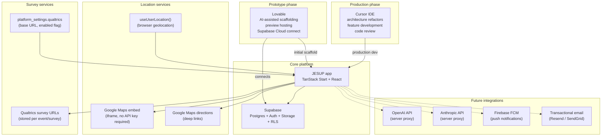

### Integration summary

| Service | Role | Integration point | API key required |
|---------|------|-------------------|------------------|
| **Lovable** | Prototype, preview deploy, Supabase connect | `vite.config.ts`, Lovable Cloud dashboard | No (platform) |
| **Cursor** | Production IDE, AI-assisted development | Local git repo | No |
| **Supabase** | Database, auth, storage, RLS | `src/integrations/supabase/client.ts` | Publishable key (client-safe) |
| **Google Maps** | Market/event maps, directions | `src/lib/market-geo.ts`, embed iframes | No (embed mode) |
| **Qualtrics** | External surveys | `qualtrics_url` columns, settings | No (URL redirect) |
| **OpenAI** *(future)* | Ask JESUP AI, content generation | Server functions in `src/modules/ai/` | Yes (server-only) |
| **Anthropic** *(future)* | Alternative AI provider | Server functions | Yes (server-only) |
| **Firebase FCM** *(future)* | Push notifications | Notification worker + mobile SDK | Yes (server + mobile) |

### Lovable → Cursor handoff

| Lovable provides | Cursor extends |
|------------------|----------------|
| Initial TanStack Start scaffold | Modular `src/modules/` architecture |
| Supabase Cloud connection | SQL migrations in `supabase/migrations/` |
| `@lovable.dev/vite-tanstack-config` | **Do not duplicate Vite plugins** — extend via `defineConfig` only |
| Preview deployments | Production build tuning, Command Center, platform services |
| `@lovable.dev/cloud-auth-js` | Auth flow hardening, admin role checks |

---

## 18. Developer quick start

### Prerequisites

- Node.js 22+
- npm
- Supabase project (URL + publishable key)
- Access to Supabase SQL Editor for migrations

### Setup

```bash
git clone <repo>
cd jesup-by-cisc
npm install
cp .env.example .env   # if present — set VITE_SUPABASE_URL and VITE_SUPABASE_PUBLISHABLE_KEY
npm run dev
```

### Apply database migrations

Run each file in `supabase/migrations/` **in chronological order** via the Supabase SQL Editor.

### Create an admin user

1. Sign up via `/auth`
2. In Supabase SQL Editor:

```sql
INSERT INTO user_roles (user_id, role)
VALUES ('<your-auth-user-uuid>', 'admin');
```

### Key commands

| Command | Purpose |
|---------|---------|
| `npm run dev` | Start development server |
| `npm run build` | Production build (Nitro + Cloudflare target) |
| `npm run preview` | Preview production build locally |
| `npm run lint` | ESLint |
| `npm run format` | Prettier |

### Where to start for common tasks

| Task | Start here |
|------|------------|
| Add a public page | `src/routes/` — new file route |
| Add domain logic | `src/lib/<domain>.ts` + barrel in `src/modules/<domain>/` |
| Add admin CRUD | `src/routes/_authenticated/admin/` + form dialog in `src/components/admin/` |
| Add DB table | `supabase/migrations/` + update `types.ts` |
| Add CMS relationship | `src/modules/cms/relationships.ts` registry + junction migration |
| Add Command Center nav item | `src/modules/admin/config/nav-items.ts` |
| Change public styling | `src/styles.css` + `src/components/design-system/` |

---

## Document control

| Version | Date | Changes |
|---------|------|---------|
| 1.0 | July 2026 | Initial system architecture reference |

---

*JESUP · The Digital Extension Wagon · Powered by CISC · Tuskegee University Cooperative Extension Program*
